## 前言
博主参加2025年电赛A题——能量回馈的变流器负载试验装置，达成了题目所有指标，在此分享整个方案设计。
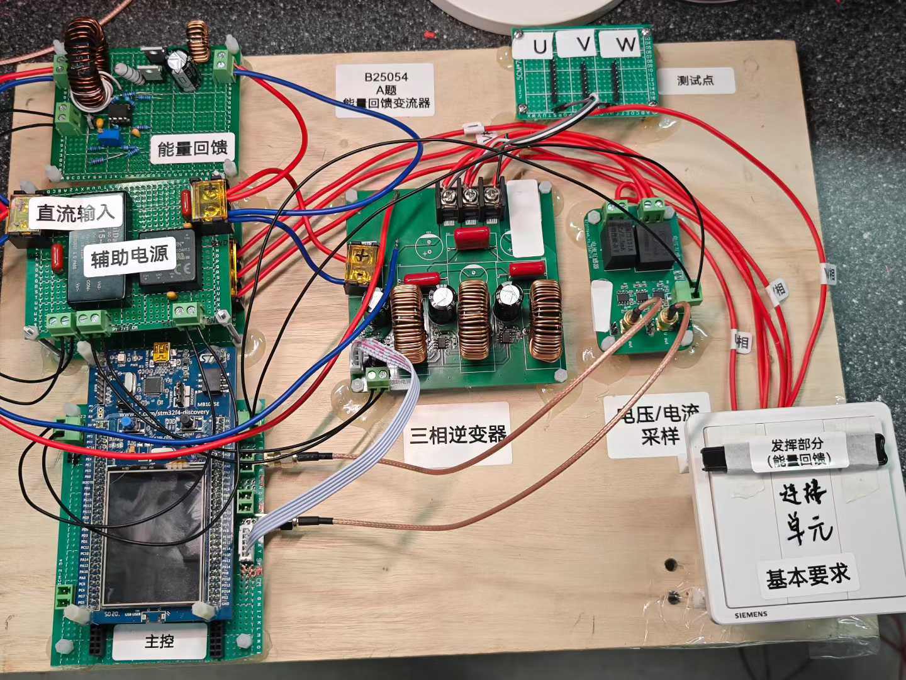
<!-- more -->

## 题目解析

### 1. 原题再现
设计并制作一个能量回馈的变流器负载试验装置（简称试验装置），其结构如图1 所示。变流器负载试验时，受试变流器1（DC-AC）将直流电变为交流电，其输出通过连接单元与变流器2（AC-DC）相连，变流器2 将交流电转换成直流电，并回馈至变流器1 的输入端，与直流电源共同给变流器1 供电，从而实现节能。
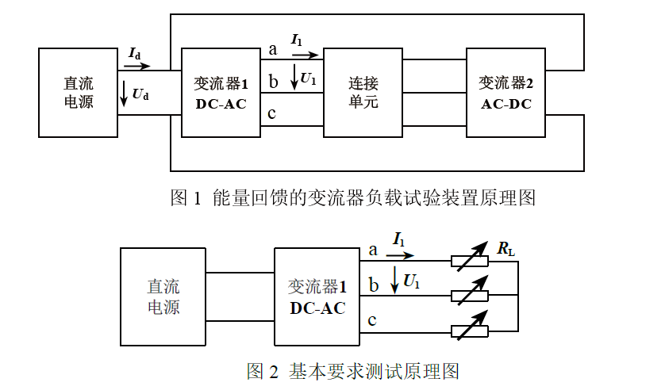

### 2. 题设要求

#### 基本要求
1. 变流器1 能输出$f_1=50Hz$、线电压$U_1=32V±0.25V$、额定线电流$I_1=2A$ 的三相对称正弦交流电。
2. 在基本要求（1）的工作条件下，要求输出交流电压总谐波畸变率（THD）不大于2%。
3. 变流器1 输出$50Hz$、$U_1=32V±0.25V$的三相交流电，$I_1$在0A~2A 间变化时，要求负载调整率$S_{I1}≤0.3\%$。
4. 要求变流器1 输出交流电的频率范围为20Hz~100Hz，步进1Hz。

#### 发挥部分

按图1 进行测试。
1. 试验装置能实现能量回馈，要求变流器1输出电流$I_1$不小于1A。
2. 变流器1 输出$50Hz$、$U_1=32V±0.25V$、$I_1 = 2A$，要求直流电源输出功率Pd=IdUd越小越好。
3. 其他。

### 3. 题目工程背景

从我自己的理解来看，这套题目并非空穴来风，而是有很强的工程实践意义的。三相电在生活当中常用于电机驱动，而三相逆变器、电机两个东西放到一起，最容易想到的就是新能源汽车。电动汽车的电源来自于一块大号锂电池，也就是一个直流电源。但是电动汽车的电机需要三相交流电才能驱动。因此，每一台电动汽车，本质上都是一台三相逆变器。这就与题目的变流器1——DC-AC三相逆变器相呼应。
其次题目的核心功能——“能量回馈”功能，与电动汽车的“动能回收”功能，有着丝丝缕缕的联系。电动汽车的电机在输入机械能时，也就变成了一个发电机，将机械能转变为电能。驱动电机需要三相电，电机发电得到的自然也是三相电，这就与题目中的变流器2相呼应，将三相电转变为直流电。
题目中，特别提到了“连接单元”这一模块，表面上，是连接逆变器、馈流器、电阻负载之间的连接单元，实际上，也可以指代电动汽车中，电机产生的机械能，返回到电机并发电产生电能，这一过程所使用的连接器、传动装置等。再者，题目所要求的变频功能，也对应着三相电机通过变频改变转速的功能。
总的来说，这一个题目，是新能源汽车电能变换全流程的缩影。

## 方案概述
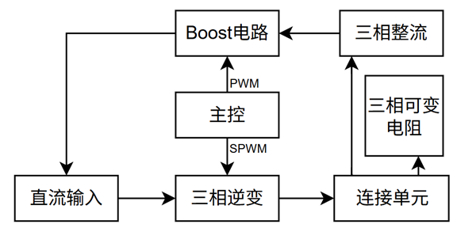
### 三相逆变器设计
#### 1. 硬件设计
三相逆变器拓扑结构就是三个半桥顶底相连，中心引出三相电。通过电感和电容组成的LC滤波器将开关过程产生的谐波过滤掉，保留50Hz的工频交流电。
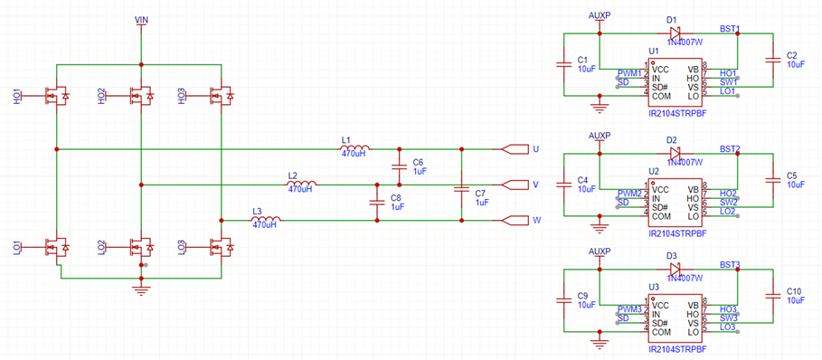
我所设计的三相逆变器采用三个IR2104半桥驱动芯片驱动六颗MOSFET，每颗IR2104都能自动产生两路互补PWM波形，单片机只需要给出高侧MOS管PWM波形，IR2104自动将其反向并添加死区，给到下管。类似于IR2104的芯片都可以使用，能够有效节省单片机的PWM资源。不过对于STM32的TIM1和TIM8来说并不重要，其具有反相输出功能，不需要额外工作。
#### 2. SPWM原理
SPWM传统上是用一个正弦波与三角波进行比较，得到一系列占空比变化的PWM波形。正弦波幅值与三角波幅值的比值即为调制比。
这里分析一下调制比与SPWM的关系，进而得到调制比与输出电压的关系。首先，如果调制比很高，比如2.0，那么意味着正弦波有很长一段时间始终高于三角波，就会导致输出一段时间的高电平，而且占空比整体都比较高。如果调制比很低，那么正弦波的幅值永远低于三角波，则不会出现某一个PWM周期的占空比为100%，占空比整体都比较低。
如果PWM占空比高，按照DC-DC的经验，输出电压就会高。结合刚才的分析，调制比高的时候，占空比整体高，则输出电压高，调制比低，则输出电压低。因此，我们通过调整SPWM的调制比，就可以改变输出电压的幅值。
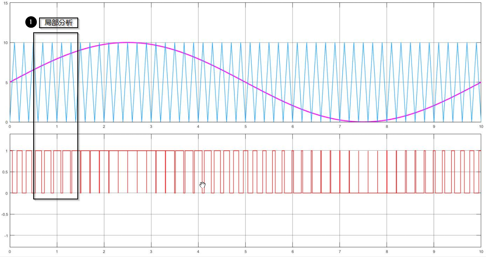
#### 3. 电压计算
考虑调制比为1.0的一列SPWM波，忽略开关损耗、导通损耗，假设LC滤波器为理想滤波器。
每一半桥的输出电压幅值
$$U_m=\frac{1}{2}U_d$$
其中$U_m$为相电压幅值，$U_d$为直流电压。
取其中两相电压做差，有以下关系：
$$
\begin{aligned}
u_A=&U_m*\cos(2\pi ft)\\
u_B=&U_m*\cos(2\pi ft + \frac{2}{3}\pi)\\
u_{AB}=&u_A-u_B\\
=&\sqrt{3}U_m*\cos(2\pi ft+\frac{1}{6}\pi)
\end{aligned}
$$
其中$u_A$、$u_B$为相电压，$u_{AB}$为线电压。
> 小写$u$为瞬时值，大写$U$为有效值，下同。

因此，线电压$u_{AB}$的电压幅值为相电压幅值的$\sqrt{3}$倍，即直流电压的$\frac{\sqrt{3}}{2}$倍。进而，线电压有效值
$$\boxed{U_{AB}=\frac{\sqrt{6}}{4}U_d\approx0.6123U_d}$$
[推导过程参考此处](https://zhuanlan.zhihu.com/p/341029717)
有了这个数据，就可以推导出直流电源供电电压。题目没有规定这一电压，可以按照我们的需求自由选择。32V线电压逆推出直流电压为52.26V。为了保险，同时也考虑到各处带来的损耗，我们最终选择58V直流电压输入。

#### 4. 软件设计
本方案采用STM32F429ZIT6 Dicovery开发板为主控。逆变器软件主要功能包括：
1. SPWM波形产生
2. 输出电压、电流采样
3. PID闭环调控
4. 可控变频

下面分别解析各个功能如何产生。
##### SPWM波形产生
传统方法产生SPWM波，是将三角波与正弦波进行比较，得到高低电平。这个方法应用在单片机上并不合适。更简单高效的方法是，通过数学计算，得出每一个周期的SPWM占空比，存储到内存里面，实时更新占空比即可。
下面推导SPWM的计算公式。本质上，SPWM就是一个占空比随正弦变化规律变化的PWM波形。当时间位于$\frac{T}{4}$的整数倍时，正弦波幅度为1，对应SPWM占空比为100%，反之，当时间位于$\frac{3T}{4}$的整数倍时，正弦波幅度为-1，对应占空比为0%。通过这个关系，可以得到如下公式
$$
duty=k*\frac{1}{2}(\cos(2\pi ft+\phi_0)+1)
$$
其中，$k$为调制比。验证一下，如果$k=2$，则$duty$在一段时间内大于1，且上升较快，占空比整体较高，反之亦然。与先前的分析一致。
单片机内，很难对当前时间进行精准的测量。更便捷的方法是用SPWM表格的索引值作为时间的指代物。
$$
duty=k*\frac{1}{2}(\cos(2\pi f\frac{index}{size}+\phi)+1)
$$
其中$size$是一个周期SPWM占空比表格的大小。$index$是表格索引。例如，$index=0$时，计算出来的占空比就是第1个周期的占空比。这里着重分析一下$size$。SPWM表格内存储一个周期的所有占空比，那么，$size$就是一个正弦周期时间内，PWM的周期数，数值上等于载波比（PWM频率与正弦频率的比值）。例如PWM频率为50kHz，输出50Hz工频交流电，则$size$为1000。
单片机计算SPWM表格的代码如下：
```c
typedef struct
{
    uint16_t* array;         // SPWM占空比表格数组指针
    uint32_t size;           // 表格大小（一个周期内PWM周期数）
    uint32_t max_value;      // PWM最大计数值（对应100%占空比）
    float phase;             // 相位偏移
    uint32_t update_max_value; // 占空比更新的最大值
} SPWM_HandleTypeDef;

void SPWM_Init(SPWM_HandleTypeDef* hspwm, uint32_t max_value, uint32_t freq, float phase)
{
    hspwm->size = PWM_FREQ / freq; // 计算表格大小
    uint32_t size = hspwm->size;
    hspwm->array = (uint16_t*)malloc((PWM_FREQ / 20) * sizeof(uint16_t)); // 分配内存
    hspwm->max_value = max_value;
    hspwm->phase = phase;
    for (uint32_t i = 0; i < size; i++)
    {
        uint32_t min = 0.01 * max_value; // 占空比下限
        uint32_t max = 0.99 * max_value; // 占空比上限
        // 计算SPWM占空比，正弦调制
        uint32_t temp = max_value * (0.5f - 0.5f * arm_cos_f32(2.0f * PI * i / size + phase * 2 * PI));
        if (temp > max)
            temp = max; // 限制最大值
        if (temp < min)
            temp = min; // 限制最小值
        hspwm->array[i] = temp; // 存入表格
    }
}
```
这串代码的缺点是使用了`malloc`函数动态分配内存。STM32的`malloc`会把这段内存分配到堆（heap）当中去，导致在STM32CubeMX生成代码时，必须手动增大堆大小。我最终增大到了0x8000，也就是32kB的堆大小，非常占用内存。
计算好SPWM表格后，借助STM32的定时器，可以直接产生PWM波形。为了能够实时更新占空比，传统做法是在定时器更新中断里面，手动更改CCR的值。这种方法需要中断主函数运行，占用CPU资源。考虑到SPWM表格并不会频繁变化，使用DMA持续搬运数据到定时器是个更好的办法。DMA设定如图。
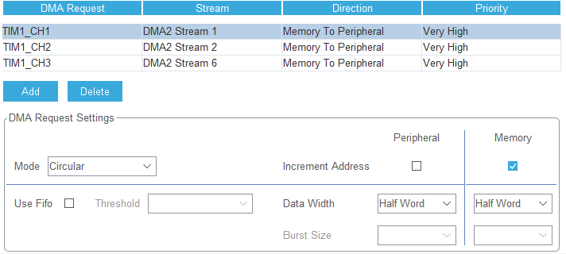
需要特别注意的是，一定要记得修改DMA方向。默认方向是P2M，我们需要M2P。此外要把模式改为Circular。
为了实现SPWM波形的实时更新，我额外添加了一个更新函数。
```c
extern SPWM_HandleTypeDef hspwm_u, hspwm_v, hspwm_w;

void SPWM_UpdateStart(uint32_t update_max_value, uint32_t updateFreq)
{
	if(updateFlag == 1)
		return;
	
	hspwm_u.update_max_value = update_max_value;
	hspwm_u.size = PWM_FREQ / updateFreq;
	hspwm_v.update_max_value = update_max_value;
	hspwm_v.size = PWM_FREQ / updateFreq;
	hspwm_w.update_max_value = update_max_value;
	hspwm_w.size = PWM_FREQ / updateFreq;
	updateFlag = 1;
}

void SPWM_Update()
{
	if(updateFlag == 0)
		return;
    
	// 更新三个相的SPWM波形
	SPWM_HandleTypeDef* handles[3] = {&hspwm_u, &hspwm_v, &hspwm_w};
	float phases[3] = {hspwm_u.phase, hspwm_v.phase, hspwm_w.phase};
	static uint32_t lastFreq = 50;
	for (int h = 0; h < 3; h++) {
		SPWM_HandleTypeDef* hspwm = handles[h];
		uint32_t size = hspwm->size;
		uint32_t max_value = hspwm->update_max_value;
		float phase = phases[h];
		if (hspwm->array == NULL) continue;
		for (uint32_t i = 0; i < size; i++) {
			uint32_t min = 0.01 * max_value;
			uint32_t max = 0.99 * max_value;
			uint32_t temp = max_value * (0.5f - 0.5f * arm_cos_f32(2.0f * PI * i / size + phase * 2 * PI));
			if(temp > max)
				temp = max;
			if(temp < min)
				temp = min;
			hspwm->array[i] = temp;
		}
	}
	if(lastFreq != freq)
	{
		HAL_TIM_PWM_Stop_DMA(&htim1, TIM_CHANNEL_1);
		HAL_TIM_PWM_Stop_DMA(&htim1, TIM_CHANNEL_2);
		HAL_TIM_PWM_Stop_DMA(&htim1, TIM_CHANNEL_3);
		HAL_Delay(1);
		HAL_TIM_PWM_Start_DMA(&htim1, TIM_CHANNEL_1, (uint32_t*)hspwm_u.array, hspwm_u.size);
		HAL_TIM_PWM_Start_DMA(&htim1, TIM_CHANNEL_2, (uint32_t*)hspwm_v.array, hspwm_v.size);
		HAL_TIM_PWM_Start_DMA(&htim1, TIM_CHANNEL_3, (uint32_t*)hspwm_w.array, hspwm_w.size);
	}
	lastFreq = freq;
	updateFlag = 0;
}
```
这一段代码主要是重新计算SPWM表格，和维护SPWM句柄结构体。其中需要注意的是。在主函数中循环调用`SPWM_Update()`，在需要的时候，调用`SPWM_UpdateStart()`，就可以高效率修改SPWM表格，并重新输出。SPWM的更新，会导致表格长度发生变化，因为输出的正弦波频率有可能改变，即题目要求的变频功能，因此需要修改DMA长度，重新启动TIM输出。需要注意的是，重新启动TIM输出时，如果不调用`HAL_TIM_PWM_Stop_DMA()`函数，直接调用`HAL_TIM_PWM_Start_DMA()`函数来更新DMA大小，是不可行的。因为如果DMA处在Busy状态，调用Start函数不会有任何效果。

##### 可控变频
只要前面SPWM写得好，可控变频其实并不难。变频只需要改变前面占空比公式中的$f$，重新计算一遍即可，唯一需要考虑的问题是数组长度。如前所述，SPWM表格长度等于载波频率与正弦波频率之比，因此，`malloc()`能够分配的数组长度，需要满足频率最小时的长度，即$\frac{f_{PWM}}{20Hz}$

##### 交流电压、电流采样
首先，电压电流采样的数据来源于我们设计的电压、电流互感器采样模块。这个模块会输出一个以1/2VCC为中心上下波动的电压波形，表征被测电压/电流的大小。单片机通过ADC采样该电压，换算即可得到实际输出电压/电流。难点在于：
1. 如何消除直流分量
2. 如何校准采样过程的误差

第一个问题看似简单，采样数据减去2047不就可以了？当然不。12位ADC采样的电压精度可以达到1mV以下，如果单纯的减去2047，表面上相当于减去了1/2VCC，实际上，由于单片机的VCC与采样模块的VCC存在些许偏差，同样是3V，单片机可能是2.95，采样模块可能是3.02，单片机减去2047并没有把采样模块输出电压的直流偏置完全减去。此外，采样模块的1/2VCC，是由电源电压分压得到。分压电阻的大小也可能有些许误差，致使直流偏置量并不是严格的1/2VCC。综合来看，各个地方电压的误差，累计起来，在ADC采样数据身上，会产生很大的误差，单纯的减去2047是无法消除直流分量的。由于我们后面还要计算RMS有效值，任何直流分量都会很大的影响RMS计算结果。因此，必须用更加准确的方法去除直流分量。
借助arm_dsp库中的`arm_biquad_cascade_df2T_f32()`函数，可以快速计算二阶差分方程组成的IIR高通/低通滤波器。这里我们使用一个一阶IIR高通滤波器过滤掉直流分量。其差分方程如下：
$$y[n]=x[n]-x[n-1]+\alpha\cdot y[n-1]$$
该差分方程是一个一阶高通滤波器。截止频率计算公式如下：
$$fc\approx\frac{\left(1-\alpha\right)\cdot f_s}{2\pi}fc$$
代入$\alpha=0.995$，若$fs=1000\ Hz$，求得$fc≈0.796 Hz$。
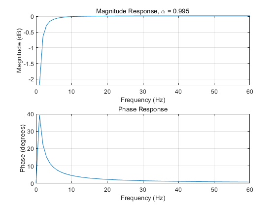
其幅频响应和相频响应如图。可以看出，其对低频信号的影响较大，对20Hz以上的信号基本没有影响。能够满足题目20-100Hz的变频范围需求。
ADC采样的数据，通过下面这个函数计算成有效值：
```c
float RMS(uint16_t* buffer, uint32_t size)
{
    float sum = 0;
    float volt;
    for (uint32_t i = 0; i < size; i++)
    {
        volt = buffer[i] * 2.985f / 4095 / 0.0214238f;
        arm_biquad_cascade_df2T_f32(&dcBlocker, &volt, &volt, 1);
        sum += volt * volt;
    }
    sum = sqrtf(sum / size);
    return sum;
}
```

第二个问题，如何校准采样数据呢？
在实际系统中，理论设定值（Target）和实际测量值（Real）之间往往存在系统误差，例如硬件精度、温漂、非线性等。
为了获得准确的实际输出，我们需要根据测得的校准数据，对设定值进行补偿。实际应用中，我们很容易测量出设定值与实际值的数据点，例如：
| Target（设定） | Real（实际） |
| :-: | :-----------: |
| 1.00 | 2.84        |
| 2.00 | 4.93        |
| 3.00 | 6.33        |
| 4.00 | 7.31        |
| 5.00 | 8.01        |
| 6.00 | 8.50        |
| 7.00 | 8.88        |
| 8.00 | 9.16        |
| 9.00 | 9.38        |

如果我们想得到实际输出=3.0V，直接设定Target=3.0V会导致输出电压为6.33V。为了得到真正的3.0V，我们需要将设定值调整到大约1.1V。这就是这套校准理论的核心。
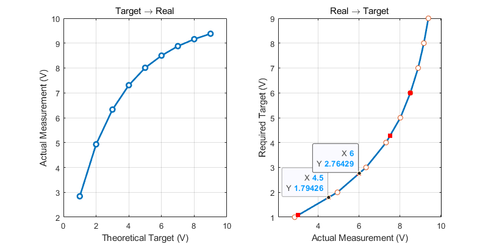
左侧的图是传统思维画出的输出曲线，他代表了不同的设定值下，输出值的变化。但这不是我们想要的。我们需要的实际上是这个函数的反函数，也就是右侧的图。可以看到，如果我输入x=6，y=2.76，也就是说，我想要实际输出电压为6时，设定电压应当为2.76，因此，我只要构建出右侧的函数曲线，即可实现目标值与实际值的校准。
这里我专门写了一个校准用的库，可以用在各个项目里面，将理论值与实际值建立起一个函数关系，然后用实际值逆推出理论值，实现校准功能。
这块主要是AI写的代码，我只是提供了思路。
```c
void Calibration_Init(Calibration_HandleTypeDef* cali, const float* target, const float* real, uint32_t length)
{
    if (length < 2 || target == NULL || real == NULL) {
        // Handle invalid input
        return;
    }

    // Initialize the calibration structure
    cali->target = target;
    cali->real = real;
    cali->length = length;

    // Allocate memory for k and b arrays
    cali->k = (float*)malloc(sizeof(float) * (length - 1));
    cali->b = (float*)malloc(sizeof(float) * (length - 1));

    if (cali->k == NULL || cali->b == NULL) 
    { 
        // Handle memory allocation failure
        return;
    }

    // Calculate segments
    for (uint32_t i = 0; i < cali->length - 1; i++) 
    {
        float x0 = cali->real[i];
        float x1 = cali->real[i+1];
        float y0 = cali->target[i];
        float y1 = cali->target[i+1];
        cali->k[i] = (y1 - y0) / (x1 - x0);
        cali->b[i] = y0 - cali->k[i] * x0;
    }
}

float Calibration_Apply(Calibration_HandleTypeDef* cali, float real_value)
{
    // Overflow and underflow checks
    if (real_value <= cali->real[0])
        return cali->k[0] * real_value + cali->b[0];
    if (real_value >= cali->real[cali->length - 1])
        return cali->k[cali->length - 2] * real_value + cali->b[cali->length - 2];

    // Find the segment for the given real_value
    for (uint32_t i = 0; i < cali->length - 1; ++i) {
        if (real_value >= cali->real[i] && real_value <= cali->real[i+1]) {
            return cali->k[i] * real_value + cali->b[i];
        }
    }
    // In case no segment found, return an error value or handle it appropriately
    return -1;
}
```

##### PID闭环调节
PID属于老生常谈的问题了。需要注意的是，为了更加稳定的调节输出电压，我使用了增量式PID控制器，实时调控SPWM的调制比，从而控制输出电压。PID我也写成了一个库，各个项目都能用，直接看代码即可。
```c
typedef struct {
    float Kp;  // Proportional gain
    float Ki;  // Integral gain
    float Kd;  // Derivative gain
    float target; // Desired value
    float integral; // Integral term
    float integral_limit; // Limit for integral term to prevent windup
    float previous_error; // Previous error for derivative calculation
    float prev_prev_error;
} PID_HandleTypeDef;

void PID_Init(PID_HandleTypeDef *pid, float kp, float ki, float kd, float integral_limit)
{
    pid->Kp = kp;
    pid->Ki = ki;
    pid->Kd = kd;
    pid->previous_error = 0.0f;
    pid->integral = 0.0f;
    pid->integral_limit = integral_limit;
}

void PID_SetTarget(PID_HandleTypeDef *pid, float target)
{
    pid->target = target;
}

void PID_Reset(PID_HandleTypeDef *pid)
{
    pid->integral = 0.0f;
    pid->previous_error = 0.0f;
}

void PID_Compute(PID_HandleTypeDef *pid, float current_value, float *output)
{
    float error = pid->target - current_value;
    pid->integral += error;
    // Limit integral to prevent windup
    if (pid->integral > pid->integral_limit) {
        pid->integral = pid->integral_limit;
    } else if (pid->integral < -pid->integral_limit) {
        pid->integral = -pid->integral_limit;
    }
    float derivative = error - pid->previous_error;
    *output = pid->Kp * error + pid->Ki * pid->integral + pid->Kd * derivative;
    pid->previous_error = error;
}

void PID_ComputeIncremental(PID_HandleTypeDef *pid, float current_value, float *output)
{
    float error = pid->target - current_value;
    float delta_output = pid->Kp * (error - pid->previous_error)
                        + pid->Ki * error
                        + pid->Kd * (error - 2 * pid->previous_error + pid->prev_prev_error);
    *output += delta_output;
    pid->prev_prev_error = pid->previous_error;
    pid->previous_error = error;
}
```

至此，三相逆变器的设计就介绍完了。

### 电压电流采样模块设计
该模块来源于立创开源广场，[开源连接](https://oshwhub.com/824366a/voltage-current-transformer)，做了部分修改。
#### 1. 互感器电路设计
电压电流采样都是用互感器隔离采样的，但是电压和电流不能选择同样的互感器。电压互感器是并联在电路中的，流过的电流应当很小（内阻很大），而电流互感器是串联在电路中的，有可能流过很大的电流。所有的互感器都是将电流按比例感应到次级，因此电压互感器，流过小电流，应当有很小的电流互感比。电流互感器，流过大电流，应当有很大的互感比，使得次级电流很小。同时，次级必须有I-V转换电路（一个电阻或者一个跨阻放大器）将电流信号转变为电压信号。

#### 2. 放大电路设计
放大电路主要负责：将电流信号转变为电压信号、抬升至1/2VCC、放大一定的倍数。这块电路很简单，参考开源链接即可。

### 馈流电路设计

#### 1. 理论分析
按照题目要求，需要将三相交流电变流送回直流输入端，实现能量回馈的功能。那么，如果馈流电路接入直流输入端，就会形成两路直流电源并联的情况，此时，必须有一方以电流源的形式输出，否则会因为微小的电压差异灌入大电流。因此，馈流电路的基本思路就确定了，是一个恒流输出的直流电源，输入三相交流电，输出恒流直流电。
#### 2. 拓扑选择
首先，三相交流电转直流电，有很多种办法，最简单的就是二极管整流电路。
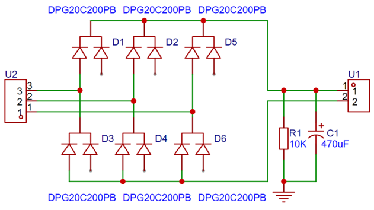
这样整流得到的电压是固定的，如果交流线电压为32V的话，整流输出电压大约为46V。显然，经过逆变-整流的操作，直流电压相比于输入的时候明显下降了。因此想要将能量输送回去，需要升压。
升压拓扑有很多种，常用的无非就是Boost电路和反激电路。二者最大区别在于隔离/非隔离。我们逆变出的相电压，实际上是以电源地为参考的，而线电压是相电压的差，事实上也是以电源地为参考的，并不是浮地的，因此整流出来的电压，也是以电源地为参考的，并不是浮地或者有高共模电压的。综合来看，这个升压不需要隔离拓扑就可以，因此我们选择Boost拓扑作为馈流电路的主拓扑
#### 3. 方案设计
整流电路刚才已经介绍过了，使用最基本的二极管整流就可以。不过，二极管整流会导致效率下降，馈流之后的直流电源输出电流偏高，馈流效率较低。我们做方案的时候并没有太考虑效率的问题，于是就使用了最简单的方案。
Boost电路我们设计了两种方案，一种是数控双向DC-DC、PID恒流，另一种是采用L6561芯片搭建的恒流控制电路。
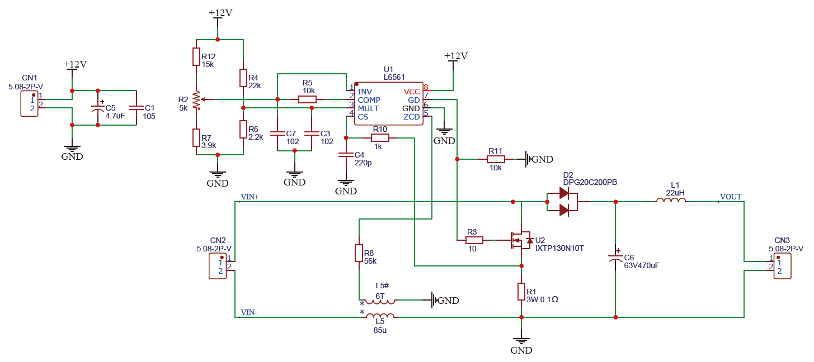
L6561虽然是一个PFC控制芯片，但是只要将MULT引脚接入直流电平，而不是接入交流参考波形，就可以当作一个普通的恒流控制芯片使用。因为实验室这款芯片有很多，而且工作起来比较稳定，就选择了这个芯片做控制。
数控方案我们使用预先设计好的双向DC-DC模块制作的，模块集成了双向的电流采样、电压采样、半桥驱动等。回馈效果也很好，但是一旦接入，单片机计算量就太大了，因此放弃了数控方案。下面是双向DC-DC的原理图
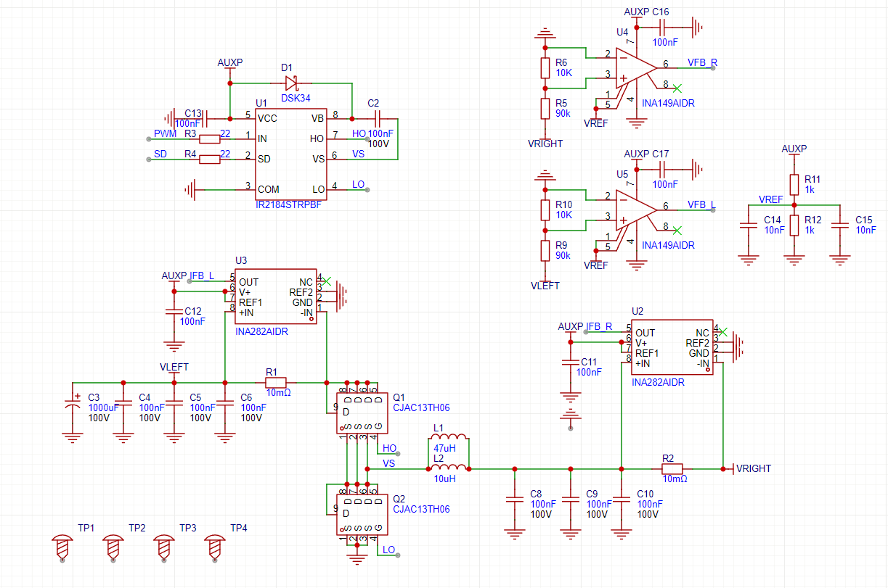

### 连接单元
题目当中的连接单元，只在发挥部分有提到，是三相逆变和三相整流之间的连接。在这个题目中，按照我的理解，这个连接单元就是三根导线，将逆变出来的三相电接入整流电路，因此并不存在什么连接单元的说法。
我将连接单元的概念扩展到了基础部分，设计成了一个基础部分与扩展部分的切换单元，使用一个三路双控开关，公共端接入逆变器输出，一端接入馈流单元，另一端接入三相电阻负载，这样如果开关打到上端，就将逆变器接入馈流单元，打到下端就接入三相负载。

### 作品接线

由于我们没有设计自己的开发板，使用的成品开发板，开发板的IO口都是由杜邦线引出的。众所周知，杜邦线在电赛当中百害而无利，需要尽可能避免。为了能将开发板的IO口牢牢的引出，我们在一块洞洞板上焊接杜邦母座，整个开发板插入，在洞洞板边缘焊接好需要的接插件（主要包括XH2.54接口和KF2EDG15K系列5.08mm的接插件），形成一个“转接板”，接插件与杜邦母座连接好线，接插件就可以随意连接到其他模块上。模拟信号全部用SMA连接器，在洞洞板上将SMA焊接好后，引线连接到IO口母座的位置，就可以连接进单片机。这样，既不破坏单片机开发板，又能够随时根据需要调整IO口引出，适应不同的赛题和作品，不需要更换单片机开发板，只需要更换一个转接板即可。