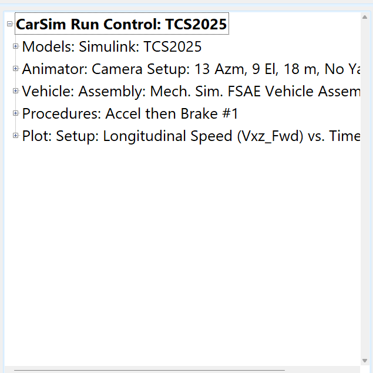
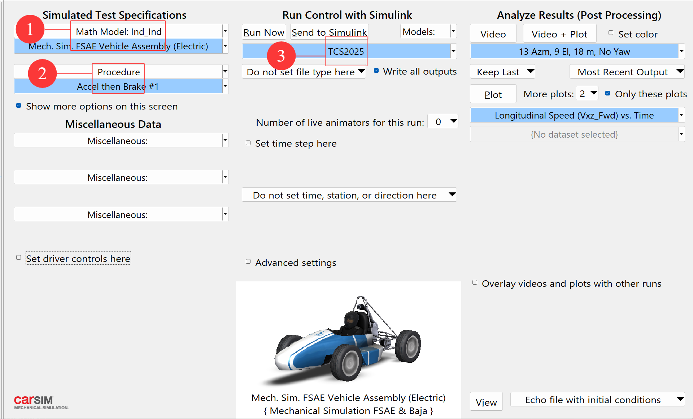
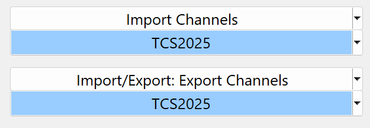
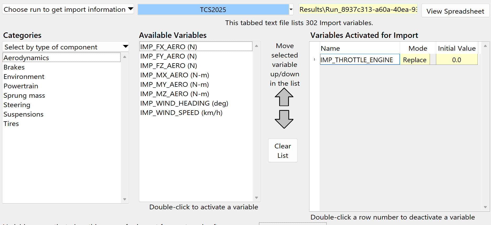

最近学习CarSim+Simulink联合仿真，开发FSEC大学生方程式赛车的TCS算法，记录一下学习过程

<!-- more -->

## CarSim简介
CarSim是一款强大的汽车仿真、自动驾驶仿真软件，具有真实的物理引擎，能够模拟各类路面、风等环境与各类发动机、变速箱、差速器乃至电动机、电池构成的车辆。

## CarSim数据结构

### 1. Database
Database是Carsim中最大的一个数据结构。一台电脑中，可以存在多个Database。每一个Database的数据不互通，因此可以实现备份、分盘等作用。一个Database对应一个电脑的物理地址，所以其本质就是一个文件夹。
### 2. Dataset
Dataset顾名思义就是数据集，也就是一系列数据的集合。他在不同的地方会有不同的含义。这里强烈建议观察一下左下角的树状图

例如，如果选择Run Control的Dataset，这一个数据集包含Models, Animator, Vehicle, Procedures, Plot等五个部分的数据集。选择好了Run Control的数据集后，如果想要修改一部分仿真参数，可以分别修改每一个模块的数据集。例如，如果把Vehicle的数据集修改掉，那么只修改了这个仿真的车辆，其他部分不变。当然，Vehicle数据集，也包含很多小数据集，修改一个Vehicle数据集是同步修改了包含的所有小数据集。数据集是由一堆数据集嵌套而成的，整个软件中，最大的数据集，就是Run Control数据集，它包含了仿真的所有参数和数据。它可以对应到其他软件常见的“工程”的概念。

## Carsim常用参数

### Math Model数据集
这个数据集包含了车辆的所有基本信息，例如长度、宽度、轴距、重心、重量等。

### Procedure数据集
这个数据集包含了仿真的流程。例如：地图、路面、路线、加速、减速、起始位置、视角等关键数据。

### Model:Simulink数据集
想要将CarSim与Simulink联合仿真，必须让Carsim输出我们想要的数据到Simulink，同时让Carsim从Simulink中输入我们想要的数据，实现Simulink对Carsim的监控或者控制。这个数据集就负责控制Carsim的输入/输出数据。数据集内有以下画面。

Import Channels就是输入数据，Export Channels就是输出数据。进入其中一个数据集，可以看到以下画面：

在这里就可以选择各种你想要控制的数据，双击需要的数据，将会把它添加到最右侧Variables Activated for Import栏。这个栏的顺序，就是Simulink中，输入向量的顺序。