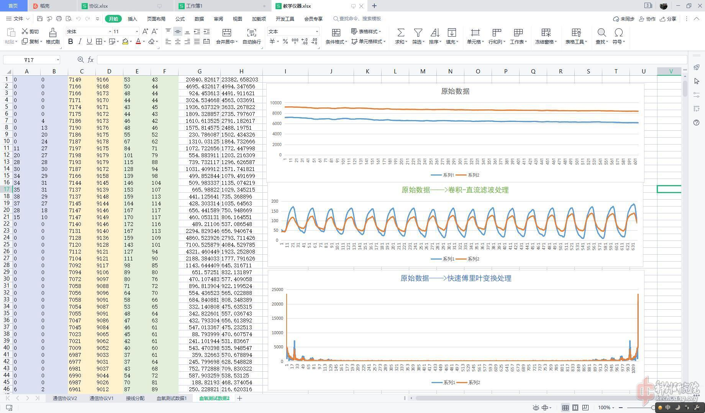
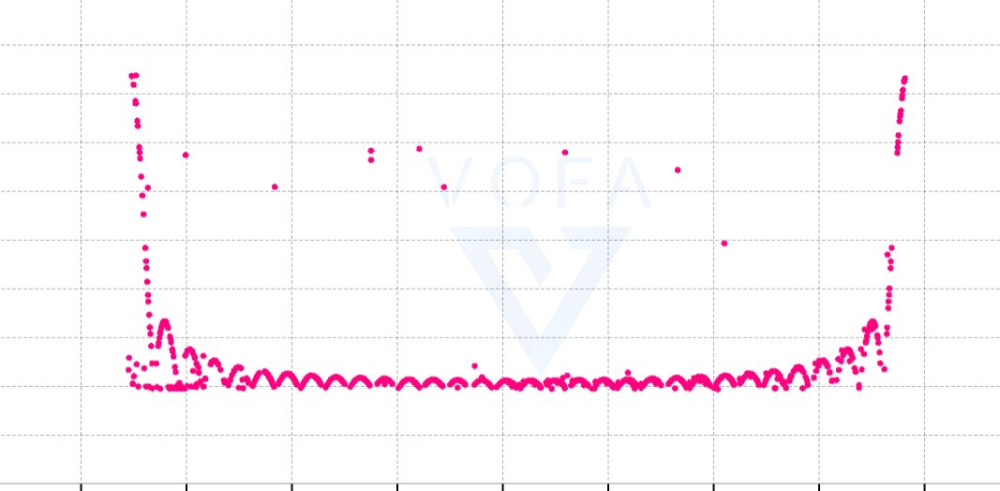
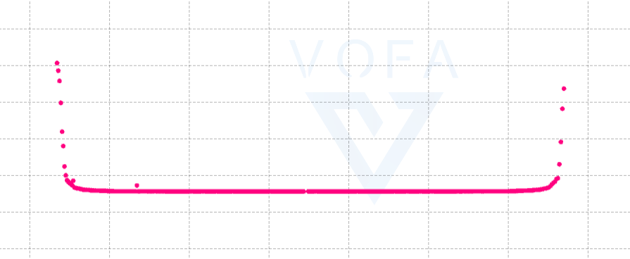

## 前言
最近的项目需要实现心率检测的功能，经过简单的搜索后决定使用基于MAX30100的心率监测模块实现这个功能项目使用STM32作为主控，通过IIC总线协议与模块进行通信，本篇博文主要记述心率监测开发和调试过程。
<!-- more -->
## 基本原理
### 检测原理
MAX30100本质上是LED驱动器+光敏传感器+高精度ADC。首先，手指毛细血管中的红细胞，在含氧量不同的情况下，吸收特定波长的光的能力是不同的，因此，反射出去的光强也会随着含氧量有所变化。一次心跳会把含氧量高的动脉血泵到手指末端，使得红细胞含氧量增加，进而导致反射光的能力发生变化。MAX30100通过光敏传感器和ADC，实时读取反射光的强度，配合软件算法，可以计算出心率。同时，反射光的强度间接反映含氧量，可以通过经验算法，推算出指尖含氧量，即$SpO_2$。
### 算法原理
MAX30100并不内置软件算法，他会原封不动的把ADC数据发送出去，由MCU进行心率计算。这里引用一个网上的图片。

> 原始博客链接找不到了，在这里说声抱歉

可以发现，原始数据上，根本看不出来数据随着心跳的变化。但是经过直流滤波+卷积滤波之后，能明显的看出来数据上下起伏，这个起伏的频率就是心跳的速度。
为了求出这个起伏的频率，我们可以应用两种方法。首先是比较简单的一种，直接把原始数据扔进FFT里面，他应该能自动求出数据变化的频率，我们只需要找到除了低频分量以外的最高峰即可。第二种方法，是对原始数据进行直流滤波+卷积之后，应用动态阈值算法，实现对原始数据交错次数的计数，从而得到变化频率。
我主要采用第一种方法。

## 硬件设计
没啥好说的，IIC，上拉电阻，配齐了就能用
## 软件设计
### 初始化
初始化部分主要是设置MAX30100的工作模式。我主要调整的是：
1. LED驱动电流24mA
2. LED脉宽1600us，即ADC采样位数16bit
3. 采样速率200samples/s
### 数据采集
MAX30100采用FIFO存储数据，大小为16，如果数据没有被及时读取，多余的数据会被丢弃。因此，MAX30100最多存储$\frac{16}{200}s$的数据。只要IIC读取走了一个数据，下一次读取的就一定是最新的数据。
虽然MAX30100设置了200sps的采样率，但是实际上，我每隔20ms才读取一次，也就是说1s读取50个点，采样率为50Hz。一般来说，采样率不是越高越好吗？为什么要故意降低采样率呢？后面FFT部分会详细解释。
### FFT
由于FFT的特点，FFT的频率分辨率可以表示为：
$$
f_{res}=\frac{f_{sample}}{N_{FFT}}\approx0.0244
$$
其中，$f_{sample}$即数据采样的频率，$N_{FFT}$即FFT点数。
由于FFT计算出来的是频率，即每秒周期数，而心率一般都是用每分钟心跳数来表示的，他与每秒心跳数差 60倍。考虑到这个因素，心跳的分辨率应该是频率分辨率的60倍。
$$
HeartBeat_{res}=60f_{res}\approx1.465
$$
也就是说，心率的分辨率是1.5左右。那么，我检测出来的心率，不可能出现两个步进的中间值，比如1.5的两个整数倍数分别是60，61.5，我不可能检测出来61次/min，也不可能检测出62次/min。因此，如果这个心率分辨率比较大，得到的心率数据效果很不好，误差会很大。
我们仔细分析心率分辨率的计算，可以发现，如果$f_{sample}$比较大，那么心率分辨率就会大，分辨能力差。如果FFT点数比较大，那么整体的分辨率变小，分辨能力提高。以上的数据都是以50sps的采样率计算的，且FFT点数为2048，即使采样率慢成这样、FFT点数这么高，得到的心率分辨率仍然比1大，效果仍然一般。这就是为什么我们要扔掉大量的采样数据，降低采样率，为了换取更高的心率分辨率。
降低采样率虽然能提高心率分辨率，但是会显著降低采样速度，导致心率刷新率慢。比如我现在50sps的情况下，如果采满2048个采样点再做FFT，一次采样需要40多秒。这个速度实在是太慢了。我为了提高采样速度，选择降低采样点数，具体方法是，采集满一定数量的点数就开始FFT，其余的数据点用0填充，这样不需要等待2048个采样点全部采满。坏处是，由于FFT的数据只有一部分有效，会导致FFT的结果不准确。
### 数据
最开始计算完FFT的时候，通过串口打印2048个数据，绘图，得到了采样数据的频谱。

可以看出，这个频谱图出现了规律性的波动，专业上应该有一个名词对应，但是我不知道。这种波动对峰值检测有一定的影响。我对原始数据添加汉宁窗之后，频谱的波动消失了

这样的波形就比较好看了，峰值的位置也是对的，只不过由于FFT精度有限，测量的心率结果仍然很差，只能说这个传感器使用起来还是挺困难的。
## 总结
MAX30100这款心率检测传感器的使用具有一定的困难，得到的检测结果也有较大的误差，需要进一步优化算法，提高对离散数据采集和处理的能力。
