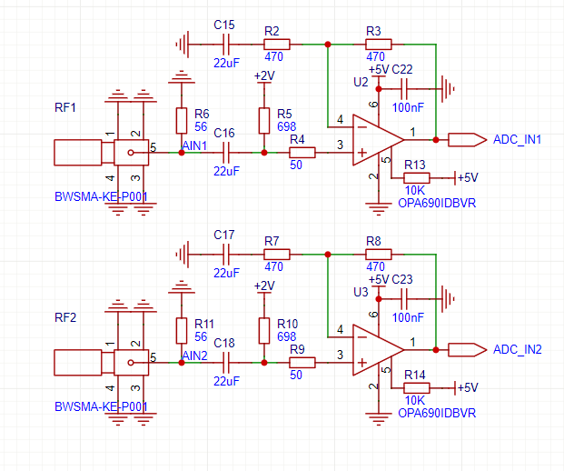
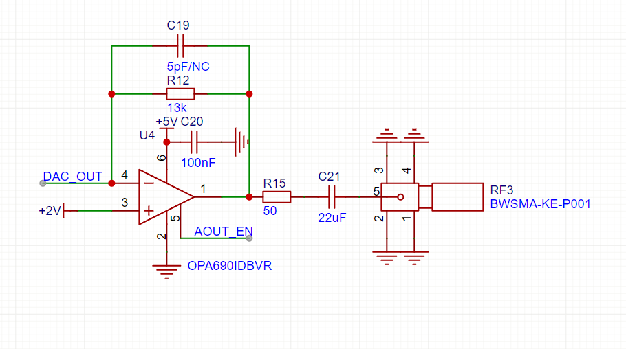
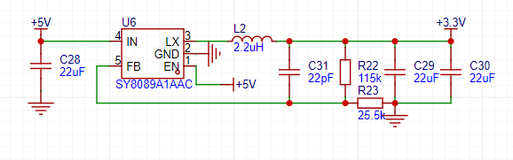
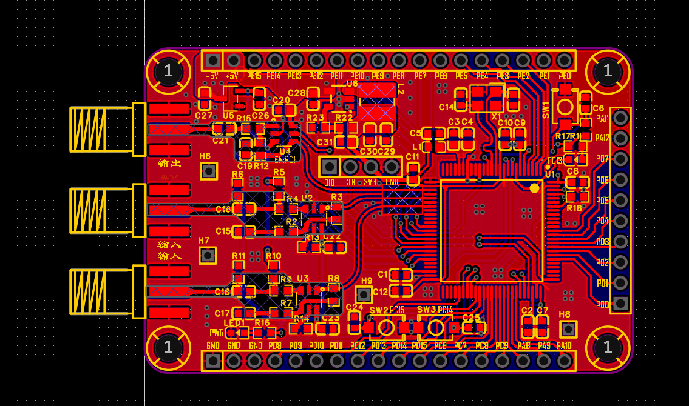

## 前言
电赛国赛即将来临，我想训练训练一些电赛的真题，首先想到的就是前年实验室学长打的2023年H题——信号分离装置。因此想设计一个开发板，既能够训练这个题目，也能够作为一个ADC、DAC的板子，为电赛比赛期间使用。
<!-- more -->
## 思路
这个板子主要想模仿B站一位大神的H题思路，FFT+IFFT直接得到两个不同的波形，然后直接输出到DAC。由于FFT本身就含有相位信息，如果直接IFFT得到时域波形也含有相位信息，相当于在采样和恢复的过程中内置了锁相环。只要FFT和IFFT的刷新速度够快，可以实现无锁相环的相位锁定。这个思路是我根据这个大神的视频自己理解的，不一定正确，还需要把实物做出来之后验证一下。
考虑到H题的最高信号频率为100kHz，而STM32H750自带的ADC速度可以达到6Msps（8bit模式），一个周期最少可以有60个采样点，相当相当的足够，所以就没有外挂ADC。而DAC的速率，按照[AN4566应用手册](https://www.st.com/resource/en/application_note/an4566-extending-the-dac-performance-of-stm32-microcontrollers-stmicroelectronics.pdf)的描述，DAC速率可以通过外挂缓冲运放提高，理论上可以提高到数据输入的最高速率40.8Msps。虽然我觉得这个数据有夸张的成分，但是肯定也是完全足够恢复整个信号的。
综合这些考虑，我使用`STM32H750VBT6`作为主控，搭配`OPA690`电压反馈运放作为输入输出调理电路，引出尽可能多的引脚，设计了一款STM32H7的电赛开发板。
## 原理图设计
### ADC采样调理电路
由于STM32的ADC输入范围是$0－+V_{ref}$，而一般情况下输入信号都是双极性的，直流分量为0，所以需要一个调理电路，把双极性的输入信号转成0－3.3V的信号，供ADC采样。很重要的一点是运放的输出范围。由于高速运放一般不具备轨到轨特性，0－5V的电源范围实际上只能输出1－4V的信号，因此为了最大化输出摆幅，我将输出的直流偏置设置成2V，这样输出摆幅可以做到2V左右。
电路如图所示。

这个电路的反馈回路是交流耦合的，这样可以实现仅对交流信号的放大、直流信号不变。
这个电路有一个很大的缺陷，就是它对输入信号是交流耦合的，即使我把耦合电容给到22uF，最终得到的频率响应的截止频率差不多在100Hz左右，小于这个频率的信号就无法正常通过了。这块电路最好是能找一找别的解决方法，实现直流耦合条件下的输入偏置变换。
### DAC输出调理电路
DAC的输出有两个作用，一方面把DAC输出的0－3.3V信号转换成双极性输出，另一方面借助运放的特性，提高DAC的采样速率，实现更高速度的DAC输出。这一块电路主要参照[AN4566应用手册](https://www.st.com/resource/en/application_note/an4566-extending-the-dac-performance-of-stm32-microcontrollers-stmicroelectronics.pdf)中的描述，然后输出的时候增加一个耦合电容，就可以把单极性输出的信号转换成双极性。考虑到高频阻抗匹配的问题，增加一个50欧姆的输出内阻。这个阻抗需要考虑到DAC内部输出的阻抗和耦合电容的阻抗，适当进行调整，比如改成22欧姆。

### 其他
#### 电源

依旧是用烂了的SY8089，万能DC-DC，效果好，元件少。
#### 外部接口
考虑到开发板的特性，最好还是能够引出大部分IO口。受限于板子尺寸，最多只有三面能够安放排针，我个人又很讨厌使用双排针，因此最终只引出了`PE[15:0]`、`PD[15:0]`、部分`PC`和`PA`口。这一块因为画的时候有点草率，IO口的配置其实不是最合理的。STM32的IO口，`PA`和`PB`的功能时最多的，应该尽可能多引出`PA`和`PB`的接口。后面的设计应当以此为经验。
## PCB设计
> 设计完了之后，才发现DAC只引出了一路输出，所以这个板子没有打样，也没时间重画了。

PCB设计时，首先考虑到三路模拟信号的线路，把运放和SMA座子摆好。整个模拟线路和运放区域都要双面挖空铺铜，防止PCB寄生电容影响信号带宽。走线尽量宽而顺，弯折处使用圆弧连接，最大限度保证阻抗匹配。
实际上，STM32H7的ADC没有那么高的精度，也不是很有必要在信号通路上下这么大功夫。

其他的电路就没有什么好说的了，都是STM32开发板的典型设计，只不过由于线路较多，需要仔细安排走线顺序，尽量少打孔，保证信号的完整性。