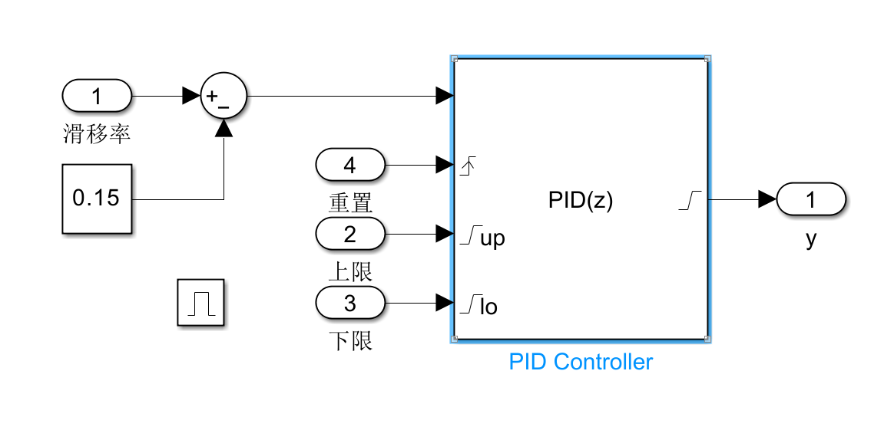
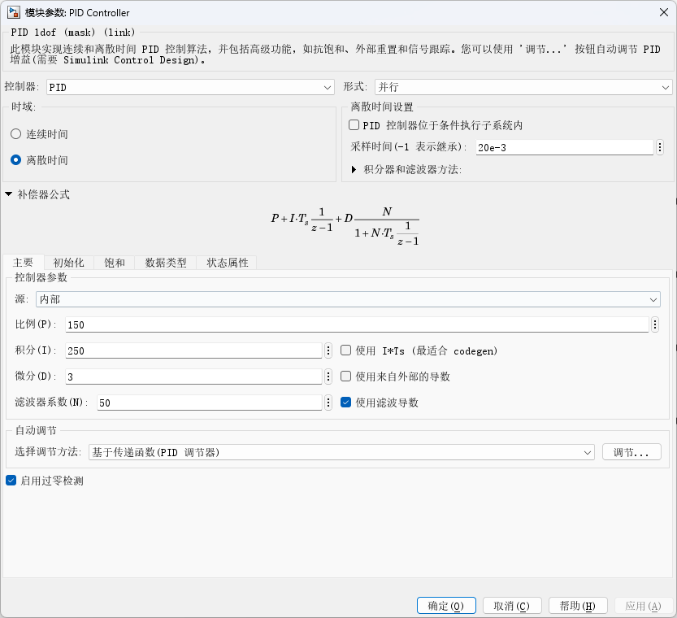
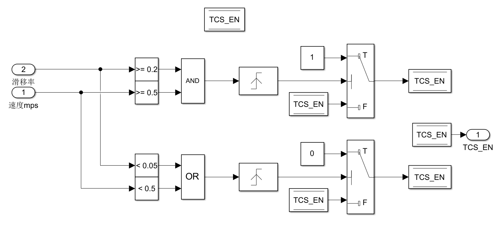
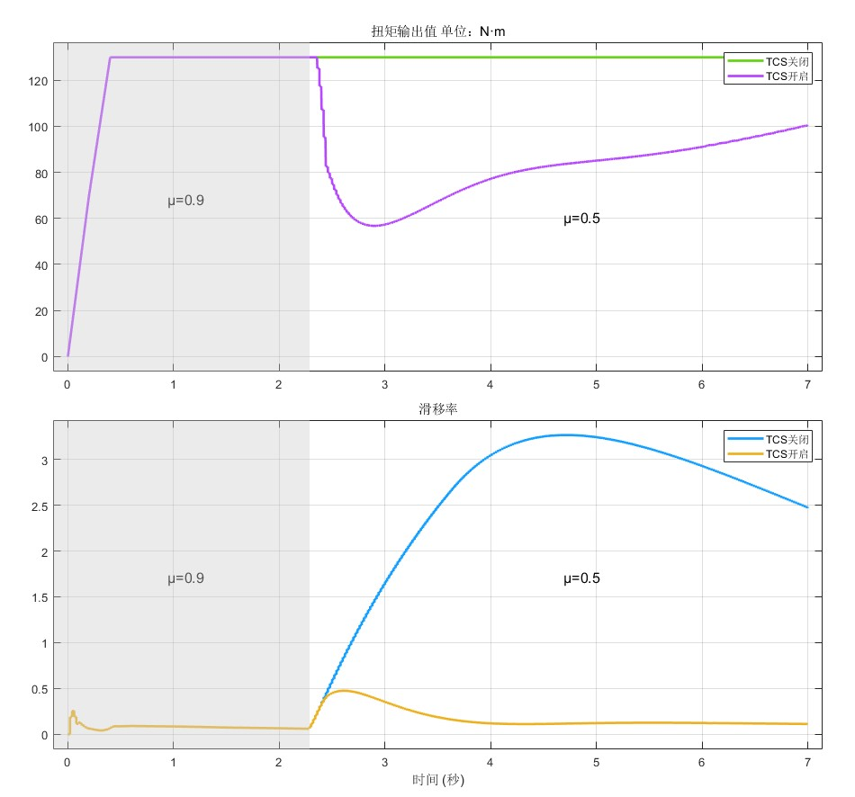

本文是对之前开发的TCS算法的一次更新，提高了算法的可靠性和有效性，并补充了不同路面条件下的测试结果

<!-- more -->

## 缺陷和不足
此前开发的TCS算法，从思路到实现上存在诸多不足，主要包括以下几点：
1. PID计算方式有误，下文将详细解释
2. 存在持续积分的问题，积分未清零，多次使用TCS会累计误差
3. 对车辆静止或车辆抓地力强等不需要TCS介入的条件没有感知，TCS始终开启，有可能出现危险
4. PID补偿扭矩的上下限没有动态调整。针对不同的车手输入扭矩，应当有不同的上下限

针对上述问题，在比赛结束季后阶段，对TCS算法进行迭代开发，完善功能，提高可靠性。

## 更新和完善

### 修改PID计算方法
此前的TCS算法中，PID调控方法是：
1. 计算滑移率误差。滑移率误差$\Delta s=0.2-s$
这里的计算方法就有问题。正确的误差为$\Delta s=s-0.2$。因此得到的是滑移率误差的相反数
2. 对滑移率误差应用PID算法，得到补偿扭矩
当滑移率较高时，PID得到的结果也较高，但是我们期望的是滑移率较高时，输出扭矩小，补偿扭矩应当为负。因此前面对滑移率误差取相反数后，PID的结果随之取反，滑移率越大，补偿扭矩越小（绝对值增大），理论上是正确的。
实际上这种方法非常反直觉，反人类，属于是屎山代码了。
3. 将补偿扭矩与车手输入扭矩相加
这一步看起来是符合直觉的，实际上却不正确。对于正确的PID结果，应当为正值，我们期望减小输出扭矩，所以应当将补偿扭矩与车手输入扭矩相减。

修改后的PID算法如下

滑移率与滑移率目标相减，得到误差（高于目标为正），进入PID后，得到的补偿扭矩结果也为正。实际输出扭矩为车手输入扭矩减去补偿扭矩。即可实现PID调控效果。
这样的计算方式更加符合直觉，也符合PID调控结果一般为正值的习惯。

#### 添加PID上下限
如上图所示，我在PID控制器上添加了外部控制的上下限，和重置信号。上下限是车手输入扭矩的±60%。重置信号来源于TCS的介入信号，下文会详细解释。

这里详细解释一下PID上下限的问题。为了避免人机对抗的情况发生，TCS的补偿扭矩不应高过车手的输入扭矩，保证车手时时刻刻都能掌握最高操纵权。实际运行中，让补偿扭矩控制在车手输入扭矩的±60%范围内，是一个既保证效果又保证安全的数值。尤其是当车手松开油门，扭矩为0时，TCS算法很难保证此时的输出就是0，因此存在车手松开油门，车辆仍然前进的情况。这样的情况十分危险。上下限按照车手输入扭矩进行动态调控后，如果车手松开油门，那么TCS的上下限也是0，TCS不会对车辆有任何干扰。

#### 添加积分饱和和重置

当PID输出饱和时，如果不采取合适的抗饱和措施，PID控制器会一直累计积分项，导致比例项和微分项失去控制意义（被极大的积分项覆盖掉）。应用Clamp钳位的抗饱和方法，控制器会自动停止积分器积分，防止积分项过大影响控制器调控效果。
此外，每次TCS介入和退出，都不应包含上一次TCS算法的积分量。因此添加了一个积分重置信号，与TCS介入信号绑定，TCS介入瞬间，会将积分量清零。

#### PID参数
没仔细调。其实算法正确的情况下，PID不同的参数影响不大，都能实现较好的调控效果。

### 添加TCS介入和退出逻辑
此前的TCS算法只有一个总开关，只要开启，TCS始终都会进行计算和补偿。理想的TCS算法应当在需要的时候介入，不需要的时候，将操纵权交还给车手。这里我设计了一个简单的状态机。

1. 同时满足以下三个条件时，TCS介入：滑移率≥0.2、车速≥0.5m/s、TCS尚未介入
2. 以下任意一个条件满足时，若TCS已经介入，退出TCS：滑移率小于0.05、车速小于0.5m/s

添加这个逻辑后，如果直接应用到PID的结果上，容易导致输出扭矩剧烈跳动。比如TCS介入时，扭矩可能突然下降40~50，影响车手感知和电机寿命。因此，增加TCS介入和退出的平滑算法，利用Simulink的Rate Limiter实现。

TCS_EN信号是一个0-1跳变信号。添加Rate Limiter后，会变成一个上升/下降沿较缓的0-1跳变信号。这个信号与TCS算法结果相乘，即可对TCS算法进行开关或线性介入和退出。

### 车手输入扭矩曲线

利用1-D Lookup Table的特性，可以实现一个模仿车手油门输入的曲线。输入是仿真时间，输出是扭矩。改变曲线即可。

### 添加空气动力学模拟
Carsim中下压力的模拟非常简单。一张图就可以概括

三个方向的力，均受到各个方向的两个系数，和A、Q两个参数决定。Q会随着速度增加而增加。修改z方向的系数就可以修改下压力设定。

## 算法整体

## 算法效果
#### 直线加速，模拟车手油门输入

#### 摩擦力突变道路模拟

