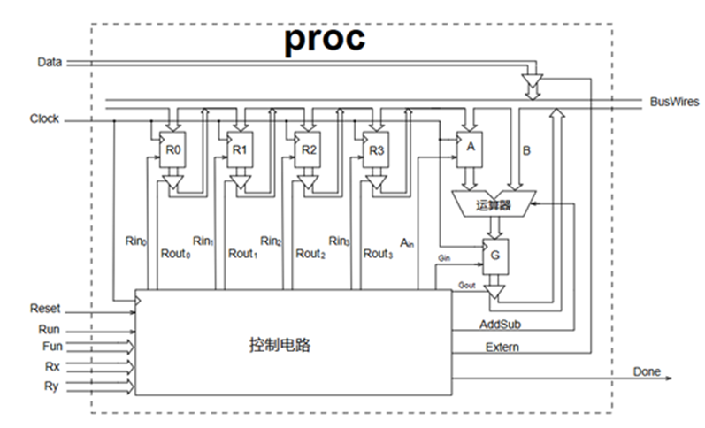

## 前言
北京市大学生集成电路设计大赛刚刚结束，这篇推文记录一下为比赛所做的准备，尤其是针对数字组第三题八位总线制CPU的前期准备和赛场发挥。

<!-- more -->

## 题目描述
设计一个含通用寄存器的8位多功能总线处理器，由总线三态输入模块、寄存器控制模块、运算部分模块和控制电路模块构成。总线三态输入模块负责实现外部数据或寄存器数据向总线输送数据；寄存器控制模块负责将总线中的数据暂时存储到对应的寄存器；运算部分模块负责将暂存在A寄存器中的数据与总线中的数据，按照指定的加减法选择项进行运算并存储到G寄存器；控制电路模块则负责配合功能需求，按特定的节拍协调寄存器、运算器和总线控制所需的信号时序。



该通用寄存器的8位多功能总线处理器内部的R0-R3，A和G共6个寄存器，需要设计4种运算功能，分别是载数，转存，加法和减法运算。该通用寄存器的功能如下表所示。
|操作|功能编码|执行的功能|含义|
|:-:|:-:|:-:|:-:|
|Load Rx,Data|00|Rx←Data|将外部数据送到指定的Rx寄存器|
|Move Rx,Ry|01|Rx←[Ry]|将Ry中的数据转存到Rx寄存器|
|ADD Rx,Ry|10|Rx←[Rx]+[Ry]|将Rx和Ry中的数据相加后送到Rx寄存器|
|SUB Rx,Ry|11|Rx←[Rx]-[Ry]|将Rx和Ry中的数据相减后送到Rx寄存器|

## 总体思路

### 总线制的含义
总线制处理器，意味着所有的数据都要通过一根总线传输，听起来好像没什么大不了的，但是实际执行起来会困难重重。例如，ALU需要两个操作数才可以进行运算，但是在总线制CPU中，所有数据都要通过总线传输，意味着ALU至少需要2个周期才可以获取到两个操作数。同理，寄存器的输入和输出也必须通过总线，导致需要预留专门的周期供寄存器写入。再者，由于总线上挂载多种设备，如果逻辑分配不当，容易使得不同设备的输出同时接入总线，形成逻辑冲突。

### 状态机设计
根据这些特点和困难，我们首先考虑到各个模块的运行周期，设计状态机转换逻辑。可以确定的是，ALU需要两个周期，寄存器写入需要专门的一个周期，然后由于各种标志位的变化与状态机的变化延后一个周期，所以必须设计一个IDLE状态机才能满足时序要求。那么把这些要求综合到一起，可以发现至少需要一个四状态的状态机才能实现。

因此，我们设计四个状态机，分别起名为IDLE、TRANSFER、EXECUTE、WRITEBACK。他们的作用如下表
|状态机|作用|
|:-:|:-:|
|IDLE|对指令进行解码，输出各种标志位|
|TRANSFER|传输ALU所需的第一个操作数|
|EXECUTE|传输ALU所需的第二个操作数，并同时进行ALU运算|
|WRITEBACK|将ALU的运算结果写入寄存器|

### 总线判决机制
总线制的CPU，不同的模块必须同时挂在总线上，但是他们不能同时向总线输出数据，那样的话会导致总线上产生逻辑冲突，也就是总线的一方输出1，另一方输出0，产生冲突。因此，必须设计一个总线判决机制，使得同一时刻只有一个模块向总线输出，其他模块保持高阻态，从总线输入的模块原本就是高阻态，这样时时刻刻保持总线只有一个模块对其输出，就可以避免总线上产生逻辑冲突。
为了实现这个效果，每一个模块的输出都应该独立出来，不直接接到总线，而通过一个多路选择器（MUX）接到总线。MUX的原则就是只有一路输入接给输出，就可以保证总线只有一个模块对其输出。这部分最好在顶层模块中实现，因为顶层模块在实例化各个模块的时候，需要将他们的输出赋值给不同的wire，再将这些wire通过MUX连接给总线的wire。代码如下：
```verilog
assign bus =	alu_out_en ? alu_out :
                extern_en ? Data :
                reg_out_en[0] ? reg_out_0 :
                reg_out_en[1] ? reg_out_1 :
                reg_out_en[2] ? reg_out_2 :
                reg_out_en[3] ? reg_out_3 :
                8'bz;
```
这里`bus`就是总线，然后总线可以连接到不同的输出，每个输出都由一个`en`信号控制，且他们具有优先级。比如说，如果`alu_out_en`为1，那么就不再考虑`extern_en`和`reg_out_en`，直接将总线接给`alu_out`。

## 控制模块设计
为了给所有的模块提供控制信号，并且执行状态机转移逻辑，我们单独设计了一个控制模块。在控制模块中，首先要读取外部输入的`Rx`，`Ry`，`Fun`等信号，并据此给出`alu_op`等信号，然后根据`clk`，改变状态机，并根据状态机来决定很多模块的控制信号。
这一块代码比较复杂，是整个CPU最大的工作量，也是最容易出错的地方。

### 状态机转移
先前所说，我们的状态机有四个状态，分别叫做IDLE、TRANSFER、EXECUTE、WRITEBACK。这四个状态的转移，控制着整个CPU运行的节拍。正常情况下，每一个`Clock`的上升沿，状态机都会向下一个状态转移。因此，每四个时钟周期，就可以完成一个指令的执行。这些都是我们在准备过程中，假想的。因为我们认为，总线制CPU的极限就是四个时钟周期，不可能更快了，所以按照四个时钟周期一条指令进行计算，应当是比较充分的。
事实上，比赛时，组委会给出的Testbench，并不是四个时钟周期完成一个指令，而是可变的。由于我没法拿到组委会的原题，只能凭记忆描述一下。转成汇编的话，大概是这样子的。
```armasm
LOAD    R0,0x33
LOAD    R1,0x22
LOAD    R2,0x11
ADD     R0,R1
MOVE    R3,R0
SUB     R1,R2
```
Testbench中，最开始是三个`LOAD`指令，但是每两条指令之间只间隔了两个时钟周期。也就是说，6个时钟周期要完成3条指令。这与我们准备的完全不符了，而且最开始我们认为完全无法实现。赛场上碰到这个问题的时候，我们也是一脸懵，因为ALU至少需要两个时钟周期才能读取两个操作数，怎么可能两个周期就能执行完呢？
但是，除了`LOAD`指令，其他的指令给的执行时间都很长，起码5、6个周期。按照4T的执行周期是能够完成的。整个执行过程，最耗时间的，其实就是ALU。这时候我们想到，其实`LOAD`指令根本不需要ALU，从总线读取，直接写入寄存器即可。那么，`LOAD`指令可以直接省去ALU转移数据所需要的两个时钟周期。所以，赛场上，我们最终的解决方案，是给LOAD指令设立特殊的转移流程，从IDLE直接转成IDLE，算上寄存器延时的一个周期，也就是两个时钟周期就可以完成。其他指令仍然四个时钟周期执行完。

### 控制信号
控制信号主要包括：外部输入控制、ALU输出控制、寄存器输出控制、ALU第一个操作数使能。这些控制信号都是根据操作码、操作数和状态机的组合逻辑产生的，只要穷举所有可能性就可以。因为可能性实在太多，所以代码很冗长，这里推荐大家先大致写一个逻辑，然后上Testbench跑，出现问题之后，定位出是哪个情况写错了/没考虑，然后再修改代码。这样得到的代码虽然比较屎山，但是对于竞赛来说，是一个又快又好的办法。

## 总结
这次的集电赛题跟我们赛前准备的内容非常相似，可以说准备到原题了，在这里记录下整个备赛的过程，既做留念，也留给后人学习。