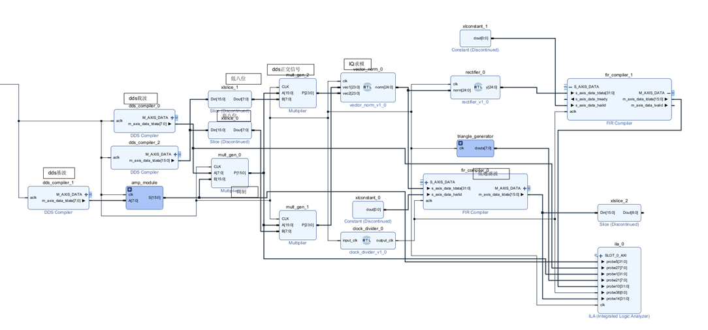
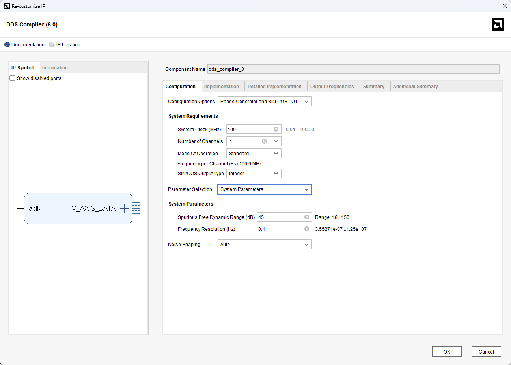
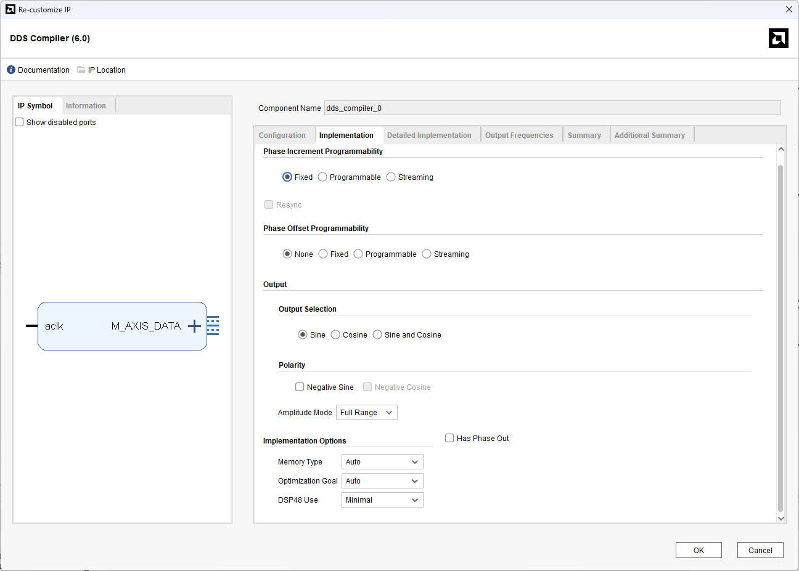
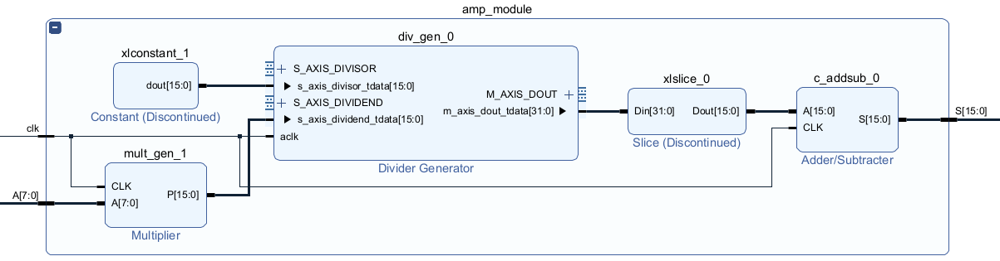
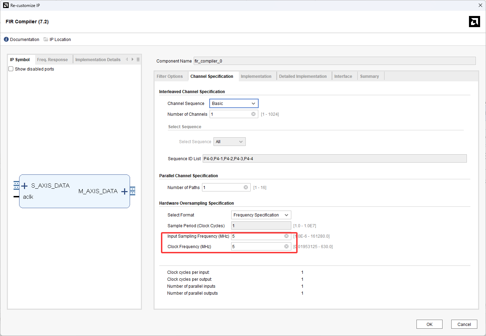
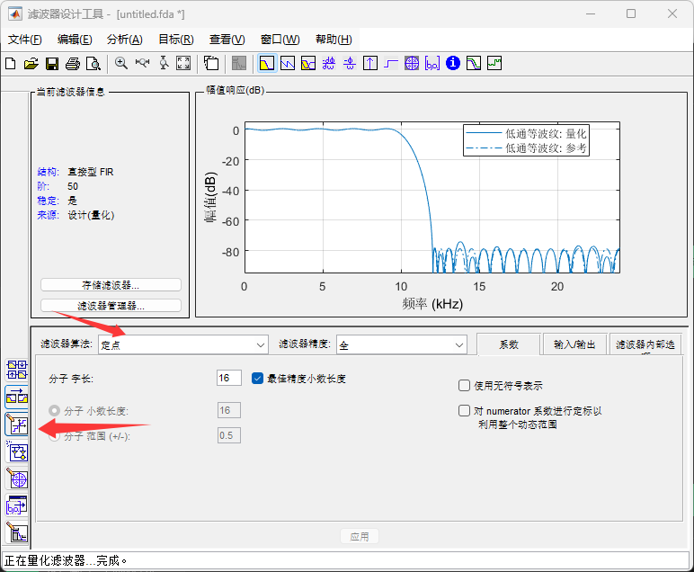
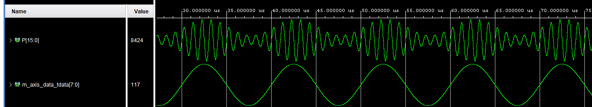
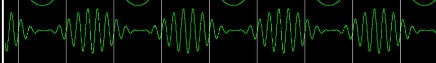
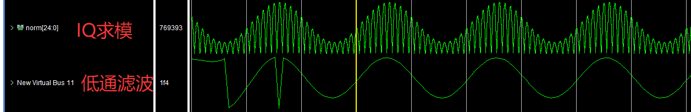

这是一个学校安排的课设任务，要求是用Vivado实现DDS、AM调制、AM相干解调三部分功能。在这里记录一下有关AM调制解调的原理、思路和实现。
<!-- more -->

## AM调制

AM——Amplitude Modulation——即为幅度调制。简单地说，就是将基波的幅度作为载波的幅度，把基波调制到载波上去。用数学方法表示为：
$$
m(t)=s(t)*\cos(\omega_ct)
$$
频谱上，等同于将原始信号的频谱双向搬移$\omega_c$个单位长度，形成分别以$\pm\omega_c$为中心对称分布的频谱。

（这里只考虑了基波为单极性的情况，双极性基波调制公式有所不同）
## AM解调
### 非相干解调
考虑一个实际的AM接收机，接收到了一个AM调制信号，长这个样子。

载波频率是1MHz，基波频率是100kHz。
最简单的解调方法是：包络检波。先进行整流，再进行滤波。整流后的信号和频谱分别为：

这个频谱可以看出来，通过一个低通滤波器可以轻松的去除掉高频分量，实现解调。解调后的波形带有一个直流分量，可以通过滑动平均或者高通滤波去除掉。
这种解调方式称为非相干解调，是因为这种方式不需要得到调制使用的载波，可以直接用调制波的特性进行解调。
### 相干解调
相干解调与非相干解调相对，是需要知道载波的频率、相位等信息才能进行解调的。基本原理如下。
首先，对一个信号乘以一个正弦/余弦信号，等同于将其频谱向两个方向搬移正弦/余弦频率个单位长度。
原始信号的频谱，是以$\omega_c$为中心的两根对称谱线。如果再乘以一次$\omega_c$的正弦信号，则会变成：
1. 以0为中心的两根对称谱线（原频谱向中心搬移），幅值为原信号幅值的一半
2. 以$2\omega_c$为中心的两根对称谱线（原频谱向两侧搬移），幅值为原信号幅值的四分之一

这时候，利用一个低通滤波器，滤除$2\omega_c$附近的频率分量，就可以完美的保留基带附近的频率分量，实现解调的效果。

### IQ正交解调
IQ正交解调，我所看到的资料中，均划分到“相干解调”这一门类下。但是按照我的理解，IQ正交解调不需要获得载波信息。这个定义有待完善。

IQ正交解调的结构框图如下：

图源：<https://www.cnblogs.com/SuperBigSaltFish0/p/18268057>，以下大部分推导过程也参考此处。

设基带信号频率为$\omega_1$，载波频率为$\omega_2$，本振频率（解调时用的频率）为$\omega_3$
先求I分量
$$
\begin{align}
I(t)&=m(t)*\cos(\omega_3t+\phi_3)\notag\\
&=s(t)*\cos(\omega_2t+\phi_2)*\cos(\omega_3t+\phi_3)\notag\\
\end{align}
$$
应用积化和差公式：
$$
\begin{align}
I(t)&=s(t)*\frac{1}{2}[\cos((\omega_2+\omega_3)t+(\phi_2+\phi_3))+\cos((\omega_2-\omega_3)t+(\phi_2-\phi_3))]\notag\\
\end{align}
$$
同理可求得Q分量
$$
\begin{align}
Q(t)&=s(t)*\frac{1}{2}[\sin((\omega_2+\omega_3)t+(\phi_2+\phi_3))+\sin((\omega_2-\omega_3)t+(\phi_2-\phi_3))]\notag\\
\end{align}
$$

> 附：积化和差公式
> $$
> \begin{align}
> \cos A \cos B &= \frac{1}{2} \big[\cos(A+B) + \cos(A-B)\big] \notag\\
> \sin A \sin B &= \frac{1}{2} \big[\cos(A-B) - \cos(A+B)\big] \notag\\
> \sin A \cos B &= \frac{1}{2} \big[\sin(A+B) + \sin(A-B)\big] \notag
> \end{align}
> $$

暂时不考虑低通滤波，我把低通滤波放到了IQ求模之后。
令$\cos(A)=\cos((\omega_2+\omega_3)t+(\phi_2+\phi_3))$，$\cos(B)=\cos((\omega_2-\omega_3)t+(\phi_2-\phi_3))$，$\sin$与之同理。方便接下来的推导。
还原信号：
$$
\begin{align}
s_{demod}(t)&=\sqrt{I^2(t)+Q^2(t)}\notag\\
&=\sqrt{2s^2(t)+\frac{1}{4}(\cos^2(A)+\sin^2(A))+\frac{1}{4}(\cos^2(B)+\sin^2(B))+\frac{1}{2}cos(A)cos(B)+\frac{1}{2}sin(A)sin(B)}\notag\\
&=\sqrt{2s^2(t)+\frac{1}{4}(\cos^2(A)+\sin^2(A))+\frac{1}{4}(\cos^2(B)+\sin^2(B))+\frac{1}{2}\cos(A-B)}\notag\\
&=\sqrt{2s^2(t)+\frac{1}{2}+\frac{1}{2}\cos(2\omega_3+2\phi_3)}
\end{align}
$$
到这里，其实就能看出一些东西了。首先，$s_{demod}(t)\approx\sqrt{2}s(t)$，也就是说，不考虑直流分量和$\omega_3$分量，解调到这里就成功了。那也就是说，如果对该信号进行低通滤波和去直流处理，就能够还原出基带信号。这就是IQ解调的基本原理。其推导过程还是比较复杂的，但是可以看出，借助一个第三频率，可以去除掉原来的载波分量，保留基波分量。这对相干解调的硬件实现具有很重要的意义，相干解调不再需要获得与发射机同频同相的载波，对接收机的要求降低了很多。

## Vivado搭建AM调制系统
从这里开始就没有什么技术含量了。我为了少写代码，基本上全都在用IP核，整个系统的搭建过程，就像在Simulink里面拿模块搭建一样。

### DDS系统
直接调用了Vivado的DDS Compiler这一IP核。相关设置如下。


需要注意的是，DDS Compiler有两种设置模式，分别叫System Parameters和Hardware Parameters。在System Parameters模式下，用户输入的是动态范围、频率分辨率等需求参数，这些参数决定了DDS的外在表现，系统会根据这些需求自动计算出能够满足需求的DDS硬件参数。Hardware Parameters模式下，用户输入的是相位寄存器位宽、输出位宽等硬件参数，系统会计算出该参数下DDS的外在表现，显示在Summary页中。这两种DDS设置模式，可以适应不同系统的不同需求。

### 幅度调整
考虑到FPGA内部对浮点数的计算，并没有明显的优势，最好还是用整数运算实现整个系统。为了调节AM调制的调制度，又必须以小数比例调整幅度，例如本来255的峰峰值，为了实现0.3的调制度，必须用255×0.3=76.5的峰峰值。为了实现这个效果，我把基带信号先乘以33，再除以100，间接实现了小数乘法运算，也就实现了近似于0.3的调制比。

## AM解调系统搭建

系统按照前文的系统框图搭建即可。不再赘述。

IQ求模运算，稍微写了一点Verilog代码，如下：
```verilog
module vector_norm(
    input clk,
    input signed [23:0] vec1,
    input signed [23:0] vec2,
    output [24:0] norm
    );
    
    reg signed [47:0]  out_reg;
    
    always @(posedge clk) begin
        out_reg <= vec1 * vec1 + vec2 * vec2;
    end
    
    cordic_0 u_cordic (
        .aclk                (clk),
        .s_axis_cartesian_tvalid(1'b1),          // 输入始终有效
        .s_axis_cartesian_tdata(out_reg),         // 输入数据
        .m_axis_dout_tdata   (norm)
    );
    
endmodule
```
记录一下FIR滤波器的设计。首先，FIR滤波器并没有内置分频器，Implementation Details里面的Input Frequency和Clock Frequency并不会直接改变clk的频率。例如，100MHz的系统里面，如果FIR想要以1MHz运行，必须把时钟一百分频之后输入FIR模块，单纯在FIR内部输入一个1MHz的Clock Frequency是不能让其正常工作的。Clock Frequency和Input Frequency我并没有搞明白他们的关系，按照网上的说法，二者必须相等，FIR才能运行。这一点在我的实验过程中得到了一定的验证，姑且认为必须这样吧。

其次，MATLAB滤波器想要生成coe文件，必须在左下角第二个按钮点开的页面里面，把系数格式从浮点数改为定点数。如下图所示。


## 系统仿真验证
AM调制波形如下：
70%调制度

100%调制度


AM解调波形如下：
