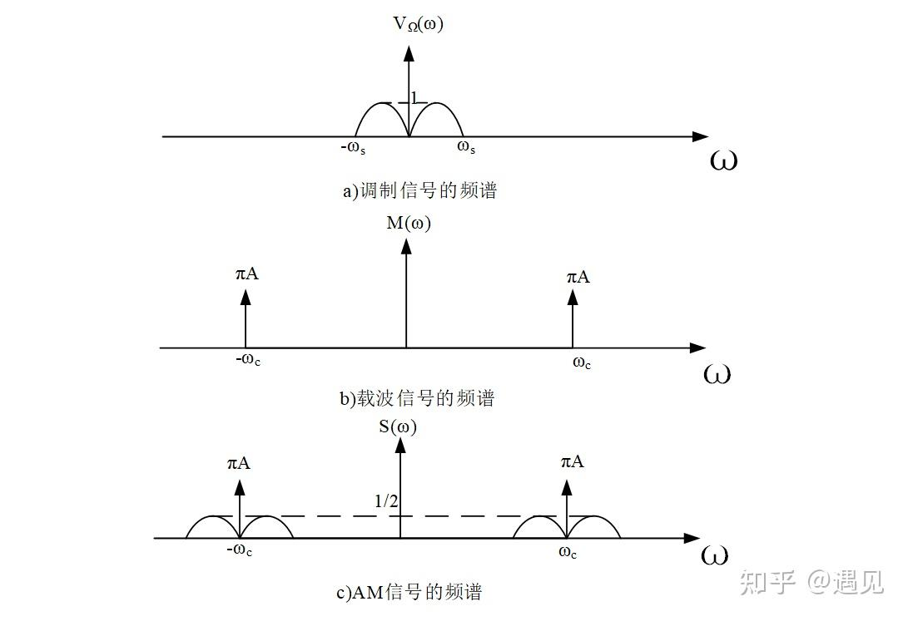
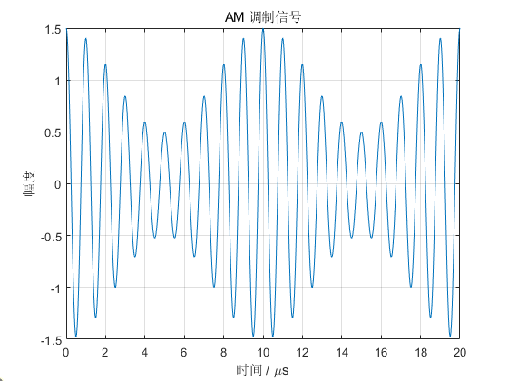
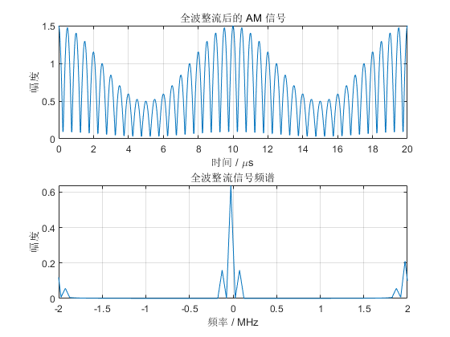
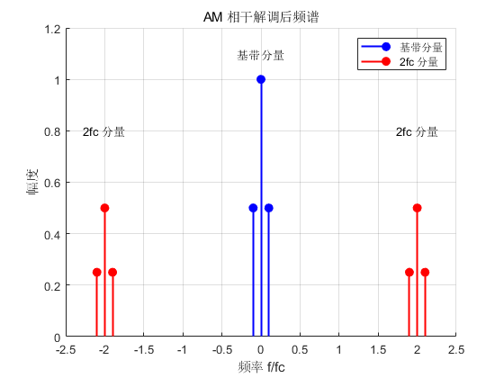
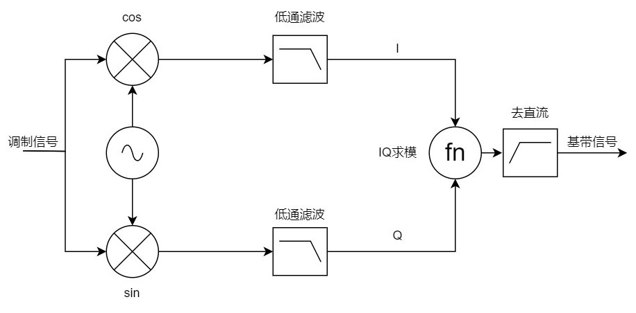

这是一个学校安排的课设任务，要求是用Vivado实现DDS、AM调制、AM相干解调三部分功能。在这里记录一下有关AM调制解调的原理、思路和实现。
<!-- more -->

## AM调制

AM——Amplitude Modulation——即为幅度调制。简单地说，就是将基波的幅度作为载波的幅度，把基波调制到载波上去。用数学方法表示为：
$$
m(t)=s(t)*\cos(\omega_ct)
$$
频谱上，等同于将原始信号的频谱双向搬移$\omega_c$个单位长度，形成分别以$\pm\omega_c$为中心对称分布的频谱。

（这里只考虑了基波为单极性的情况，双极性基波调制公式有所不同）
## AM解调
### 非相干解调
考虑一个实际的AM接收机，接收到了一个AM调制信号，长这个样子。

载波频率是1MHz，基波频率是100kHz。
最简单的解调方法是：包络检波。先进行整流，再进行滤波。整流后的信号和频谱分别为：

这个频谱可以看出来，通过一个低通滤波器可以轻松的去除掉高频分量，实现解调。解调后的波形带有一个直流分量，可以通过滑动平均或者高通滤波去除掉。
这种解调方式称为非相干解调，是因为这种方式不需要得到调制使用的载波，可以直接用调制波的特性进行解调。
### 相干解调
相干解调与非相干解调相对，是需要知道载波的频率、相位等信息才能进行解调的。基本原理如下。
首先，对一个信号乘以一个正弦/余弦信号，等同于将其频谱向两个方向搬移正弦/余弦频率个单位长度。
原始信号的频谱，是以$\omega_c$为中心的两根对称谱线。如果再乘以一次$\omega_c$的正弦信号，则会变成：
1. 以0为中心的两根对称谱线（原频谱向中心搬移），幅值为原信号幅值的一半
2. 以$2\omega_c$为中心的两根对称谱线（原频谱向两侧搬移），幅值为原信号幅值的四分之一

这时候，利用一个低通滤波器，滤除$2\omega_c$附近的频率分量，就可以完美的保留基带附近的频率分量，实现解调的效果。

### IQ正交解调
IQ正交解调，我所看到的资料中，均划分到“相干解调”这一门类下。但是按照我的理解，IQ正交解调不需要获得载波信息。这个定义有待完善。

IQ正交解调的结构框图如下：

图源：<https://www.cnblogs.com/SuperBigSaltFish0/p/18268057>，以下大部分推导过程也参考此处。

设基带信号频率为$\omega_1$，载波频率为$\omega_2$，本振频率（借条时用的频率）为$\omega_3$
先求I分量
$$
\begin{align}
I(t)&=m(t)*\cos(\omega_3t+\phi_3)\notag\\
&=s(t)*\cos(\omega_2t+\phi_2)*\cos(\omega_3t+\phi_3)\notag\\
\end{align}
$$
应用积化和差公式：
$$
\begin{align}
I(t)&=s(t)*\frac{1}{2}[\cos((\omega_2+\omega_3)t+(\phi_2+\phi_3))+\cos((\omega_2-\omega_3)t+(\phi_2-\phi_3))]\notag\\
\end{align}
$$
同理可求得Q分量
$$
\begin{align}
Q(t)&=s(t)*\frac{1}{2}[\sin((\omega_2+\omega_3)t+(\phi_2+\phi_3))+\sin((\omega_2-\omega_3)t+(\phi_2-\phi_3))]\notag\\
\end{align}
$$

> 附：积化和差公式
> $$
> \begin{align}
> \cos A \cos B &= \frac{1}{2} \big[\cos(A+B) + \cos(A-B)\big] \notag\\
> \sin A \sin B &= \frac{1}{2} \big[\cos(A-B) - \cos(A+B)\big] \notag\\
> \sin A \cos B &= \frac{1}{2} \big[\sin(A+B) + \sin(A-B)\big] \notag
> \end{align}
> $$

暂时不考虑低通滤波，我把低通滤波放到了IQ求模之后。
令$\cos(A)=\cos((\omega_2+\omega_3)t+(\phi_2+\phi_3))$，$\cos(B)=\cos((\omega_2-\omega_3)t+(\phi_2-\phi_3))$，$\sin$与之同理。方便接下来的推导。
还原信号：
$$
\begin{align}
s_{demod}(t)&=\sqrt{I^2(t)+Q^2(t)}\notag\\
&=\sqrt{2s^2(t)+\frac{1}{4}(\cos^2(A)+\sin^2(A))+\frac{1}{4}(\cos^2(B)+\sin^2(B))+\frac{1}{2}cos(A)cos(B)+\frac{1}{2}sin(A)sin(B)}
\end{align}
$$

