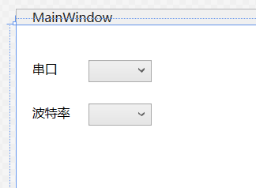
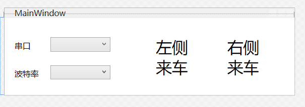

## 前言
开发两轮车雷达，调试过程中需要一个上位机程序，接收雷达传输的信息，显示在屏幕上，指示哪边来车。本篇博文将记录开发上位机的过程和遇到的问题
<!-- more -->

## 开发过程

### 窗体设置
1. 添加串口和波特率设置
   
2. 添加波特率和COM口选项
   ```cs
   List<int> listOfBaudrate = new List<int>
   {
         2400, 4800, 9600, 19200, 38400, 57600, 115200
   };
   List<string> listOfPort = new List<string>(System.IO.Ports.SerialPort.GetPortNames());
   ComboBox_Port.ItemsSource = listOfPort;
   ComboBox_Port.SelectedIndex = 0;
   ComboBox_Baudrate.ItemsSource = listOfBaudrate;
   ComboBox_Baudrate.SelectedIndex = 6;
   ```
3. 添加警示文字
   
4. 把警示文字设置成不可见

### 后台程序
1. 串口初始化
   ```cs
   private void SerialPortInit()
   {
      try
      {
         serialPort = new SerialPort();
         serialPort.PortName = ComboBox_Port.SelectedItem.ToString();
         serialPort.BaudRate = (int)ComboBox_Baudrate.SelectedItem;
         serialPort.DataBits = 8;
         serialPort.StopBits = StopBits.One;
         serialPort.Parity = Parity.None;
      }
      catch(Exception ex) 
      {
         MessageBox.Show(ex.Message);
      }
   }
   ```
2. 串口开启与关闭函数
    ```cs
    private void SerialPortOpen()
    {
        SerialPortInit();
        serialPort.Open();
        serialPort.DataReceived += SerialPort_DataReceived;
    }

    private void SerialPortClose()
    {
        serialPort.Close();
        serialPort.Dispose();
        serialPort = null;
    }
    ```
3. 串口接收回调函数
   由于接收回调函数是在另外一个线程调用的，不能直接修改GUI，需要用`Dispathcer.Invoke()`函数调用GUI线程。
   此外，`await`可以进行一个异步等待，不影响GUI线程处理，本线程等待。借此实现一段时间后自动熄灭警示的功能。
    ```cs
    private async void SerialPort_DataReceived(object sender, SerialDataReceivedEventArgs e)
    {
        int len = serialPort.BytesToRead;
        byte[] data = new byte[len];
        serialPort.Read(data, 0, len);
        string str = Encoding.ASCII.GetString(data);
        try
        {
            if (str == "Left")
            {
                Dispatcher.Invoke(() =>
                {
                    this.left.Visibility = Visibility.Visible;
                });
                await Task.Delay(500);
                Dispatcher.Invoke(() =>
                {
                    this.left.Visibility = Visibility.Collapsed;
                });
            }
            else if (str == "Right")
            {
                Dispatcher.Invoke(() =>
                {
                    this.right.Visibility = Visibility.Visible;
                });
                await Task.Delay(500);
                Dispatcher.Invoke(() =>
                {
                    this.right.Visibility = Visibility.Collapsed;
                });
            }
            else
            {
                error.Visibility = Visibility.Visible;
                await Task.Delay(500);
                error.Visibility = Visibility.Collapsed;
            }
        }
        catch (Exception ex)
        {
            MessageBox.Show(ex.Message);
        }
    }
    ```
