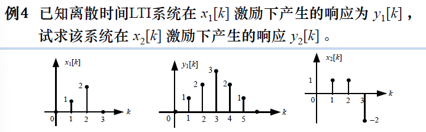
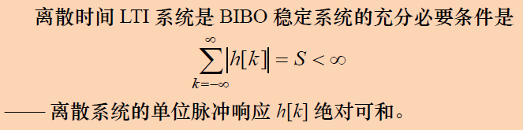
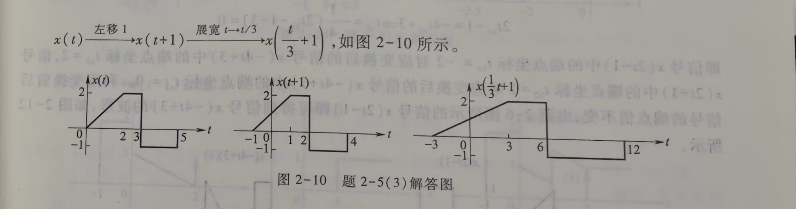

## 信号与系统知识点和例题梳理
未完待续，尽量在期末考试之前整理完。
<!-- more -->

## 信号的描述及分类

### 确定信号与随机信号

### 连续信号与离散信号
#### 连续
1. **冲激信号$\delta(t)$**
   信号大小一定要加括号
   筛选特性：$x(t)\delta(t-t_0)=x(t_0)\delta(t-t_0)$，若结果含有$x(t)\delta(t)$，必须化简一步。
   抽样特性：$\int_{\infty}^{\infty}x(t)\delta(t-t_0)=x(t_0)$
   展缩特性：$\delta(at)=\frac{1}{|a|}\delta(t)$
   $$
2. **阶跃信号$u(t)$**
   不考虑$t=0$的值（该处的函数值没有定义）
3. **斜坡信号$r(t)$**
#### 离散
1. **冲激信号$\delta[k]$**
   注意在$k=0$时函数值为1，而不是正无穷。标的时候不能加括号。
   $\delta[ak]=\delta[k]$，这点与连续的冲激函数不同。
2. **阶跃信号$u[k]$**
   $k=0$时，函数值确定为1。
3. **斜坡信号$r[k]$**
### 周期信号与非周期信号

#### 连续
定义：$\forall x \in R$，存在正实数$T$，使得$x(t+nT)=x(t)$成立。则$T$是$x(t)$的周期。
最小正实数$T_0$称为基本周期
正弦信号$x(t)=A\sin(\omega_0 t+\theta)$的周期为：
$$
T_0 = \frac{2\pi}{|\omega_0|}
$$
#### 离散
定义：$\forall k \in Z$，存在正整数$N$，使得$x[k+nN]=x[k]$成立。则$N$是$x[k]$的周期。
最小正实数$N_0$称为基本周期
**离散正弦信号$x[k] = \sin(\Omega_0k)$不一定是周期信号！**
若$\frac{|\Omega_0|}{2\pi}=\frac{m}{N}$为有理数（$m$和$N$都为不可约的正整数），则$N$为信号的周期。
虚指数序列$e^{j\Omega_0k}$的周期计算方法相同。

> #### 例：求下列离散序列的周期
> **(1)$x[k] = \sin(\frac{\pi}{5})$**
> 解：
> $$\frac{|\Omega_0|}{2\pi}=\frac{1}{10}$$
> 则周期为10
> 
> **(2)$x[k] = \sin(\frac{4\pi}{11})$**
> 解：
> $$\frac{|\Omega_0|}{2\pi}=\frac{1}{10}$$
> 则周期为10
> 
> **(3)以$T=0.4$抽样间隔对连续信号$sin(t)$抽样得到的离散信号**
> 解：
> $$sin(t)|_{t=kT}=sin(0.4k)$$
> $$\frac{|\Omega_0|}{2\pi}=\frac{1}{5\pi}$$
> 为无理数，所以不是周期信号
#### 能量信号和功率信号
归一化能量有限的称为能量信号
归一化功率有限的称为功率信号
> #### 例：判断下列信号是能量信号还是功率信号
> **（1）$x(t)=Ae^{-t}$**
> 解：归一化能量
> $$\int_{-\infty}^{+\infty}|Ae^{-t}|^2=-2A^2e^{-2t}|_{-\infty}^{+\infty}=\infty$$
> 归一化功率
> $$\lim_{T\rightarrow\infty}(\frac{1}{2T}\int_{-T}^{T}|Ae^{-t}|^2)=\lim_{T\rightarrow\infty}(-2A^2e^{-2t}|_{-T}^{T})=\infty$$
> 既不是能量信号，也不是功率信号
> **（2）$x[k]=(\frac{4}{5})^k,k\ge 0$**
> 解：归一化能量
> $$\lim_{N\rightarrow\infty}\sum_{k=-N}^{N}|x[k]|^2=\lim_{N\rightarrow\infty}\sum_{k=0}^{N}(\frac{4}{5})^{2k}=\frac{1}{1-0.64}$$
> 归一化功率
> $$\lim_{N\rightarrow\infty}\frac{1}{2N+1}\sum_{k=-N}^{N}|x[k]|^2=\lim_{N\rightarrow\infty}\frac{1}{2N+1}\sum_{k=0}^{N}(\frac{4}{5})^{2k}$$
> $$=\lim_{N\rightarrow\infty}\frac{\frac{1}{1-0.64}}{2N+1}=0$$
> 是能量信号，也是功率信号（能量信号一定是功率信号）
## 系统的描述及分类
### 系统的描述
1. 输入输出描述
2. 状态变量描述
### 系统的分类和判断
#### 离散、连续
显而易见
#### 线性非线性
1. **均匀特性**
   若$T{x(t)}=y(t)$，则$T(kx(t))=ky(t)$
   **输入翻倍，输出也翻倍。**
2. **叠加特性**
   若$T\{x_1(t)\}=y_1(t)$，$T\{x_2(t)\}=y_2(t)$，则$T\{x_1(t)+x_2(t)\}=y_1(t)+y_2(y)$
   **输入相加，输出也相加。**
3. **综合表示**
   若$T\{x_1(t)\}=y_1(t)$，$T\{x_2(t)\}=y_2(t)$，则$T\{\alpha x_1(t)+\beta x_2(t)\}=\alpha y_1(t)+\beta y_2(y)$
   **输入线性组合，输出也线性组合。**
4. **零输入和零状态线性**
   含有初始状态的系统，若系统的响应可以分解为零输入和零状态，则需要分别求线性。只要两部分都线性，系统就线性。
   若系统的响应不可以被分解为零输入和零状态（例如：$y[k]=4y[0]·x[k]+3x[k]$），则一定不线性，因为初始状态不会受输入影响，输入线性组合不会改变初始状态，也就无法使得输出线性组合。
> #### 例：判断该系统是否为线性系统
> **（1）$y(t)=y(0)sin(2t)+\int_{0}^{t}x(\tau)d\tau$**
> 解：
> $$y_{zs}(t)=\int_{0}^{t}x(\tau)d\tau$$
> $$y_{zi}(t)=y(0)sin(2t)$$
> $$T_{zs}\{\alpha x_1(t)+\beta x_2(t)\}=\int_{0}^{t}\alpha x_1(\tau)+\beta x_2(\tau)d\tau$$
$$\alpha y_{zs1}(t)+\beta y_{zs2}(t)=\alpha\int_{0}^{t} x_1(\tau)+\beta\int_{0}^{t} x_2(\tau)d\tau$$
> 输入线性组合的响应与输出线性组合相等，具有零状态线性
> $$T_{zi}\{\alpha y_1(0)+\beta y_2(0)\}=[\alpha y_1(0)+\beta y_2(0)]\sin(2t)$$ 
> $$\alpha y_{zi1}(t)+\beta y_{zi2}(t)=\alpha y_1(0)\sin(2t)+\beta y_2(0)\sin(2t)$$
> 初始状态线性组合的响应与输出线性组合相等，具有零输入线性
> 综上，该系统具有线性
> **（2）$y[k]=2y[0]+6x^2[k]$**
> 解：零输入响应$y_{zi}[k]=2y[0]$，显然线性
> $$y_{zs}[k]=6x^2[k]$$
> $$T_{zs}\{\alpha x_1[k]+\beta x_2[k]\}=6\alpha^2x_1^2[k]+12\alpha\beta x_1[k]x_2[k]+6\beta^2x_2^2[k]$$
> $$\alpha y_{zi1}[k]+\beta y_{zi2}[k]=6\alpha^2x_1^2[k]+6\beta^2x_2^2[k]$$
> 二者并不相等，所以不具有零状态线性。
> 综上，该系统不具有线性

#### 时变非时变
定义：非时变系统中，若$x(t)$产生的输出为$y(t)$，则输入$x(t-t_0)$产生的输出必为$y(t-t_0)$。离散同理。

#### LTI系统
具有线性和非时变性的系统成为线性非时变系统（Linear Time-Invariant System）。
1. 积分（求和）特性
   输入积分，输出也积分。
2. 微分（差分）特性
   输入微分，输出也微分。
这些特性可以用来根据已知的激励和响应，求线性组合、微分积分的激励产生的响应

#### 因果非因果
任意时刻的输出，都不超前于系统的输入。
例如：$y[k]=2x[k+1]$，0时刻的输出由1时刻的输入决定，超前于输入，因此不是因果系统。
##### 用单位冲激响应判断（只适用于LTI系统）

因果系统的 $H(s)$ ，则其收敛域为 $\text{Re}(s) > \sigma_0$（某个右半平面）。
因果离散系统，ROC 是以原点为中心某个圆周的**外侧区域**（即 $|z| > r_0$）

|方法|连续系统|离散系统|
|------|---------|-------|
|冲激响应|$h(t)=0,\ t<0$|$h[k]=0,\ k<0$|
|复频域收敛域|$s$收敛域包括右半平面|$z$收敛域为某一圆外|

#### 稳定非稳定
任意有界的输入，其输出都是有界的。例如：$\int_{-\infty}^{t}x(\tau)d\tau$，输入为阶跃信号时，$t\rightarrow\infty$时，输出是无穷，不满足条件。不具有BIBO稳定性。
##### 单位冲激响应判断（只适用于LTI系统）

在复频域，连续时间LTI系统具有BIBO稳定性的充要条件是系统函数$H(s)$的收敛域包含$s$平面的虚轴，即收敛域$Re(s)>\sigma_0$且$\sigma_0<0$。
在复频域，离散时间LTI系统具有BIBO稳定性的充要条件是系统函数$H(z)$的收敛域包含$z$平面的单位圆，即$|z|<r_0$且$r_0>1$。
## 信号的基本运算
**时域信号，所有的操作都是对自变量t或者x，而不是对括号内的整体。**
**先时移，再翻转/压缩/扩展**
### 翻转
### 压缩/扩展
### 时移
> 例：
### 卷积

#### 连续
$$x(t)*h(t)=\int_{-\infty}^{+\infty}x(\tau)h(t-\tau)d\tau$$
> 例：求$x(t)*h(t)$
> **(1)$x(t)=e^{-t}u(t),h(t)=e^{-2t}u(t-2)$**
> 
#### 离散

