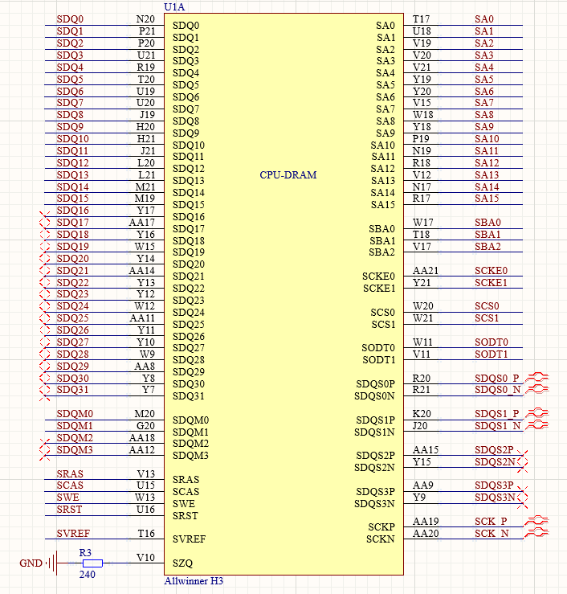
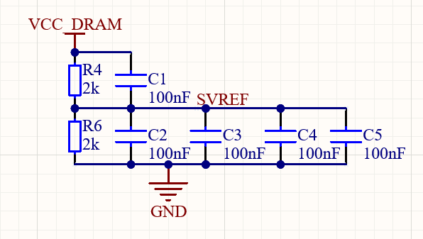
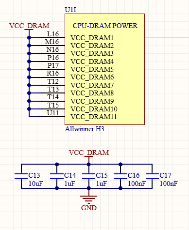
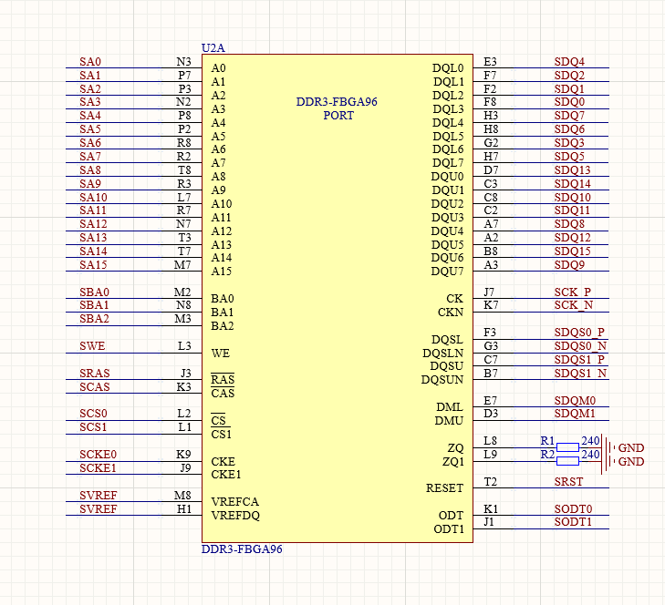

## 前言
开发全志H3的核心板过程中，原理图绘制部分有很多新知识，近期博文将全面介绍全志H3的原理图设计，把这些知识整理下来。本篇主要介绍DDR——Double Data Rate SDRAM的电路设计。

<!-- more -->

## 配置
- **CPU: 全志H3**
- **DRAM: DDR3 512MB FBGA-96**

## CPU-DRAM设计

### 概述
全志H3的DRAM控制器是32位的，可以支持两片DDR3颗粒，因此所有信号线的低半段代表一片内存颗粒，高半段代表另一颗内存颗粒。
### 分类
#### 数据线
`SDQ[0:31]`代表并行数据线，`SDQM[0:3]`是并行数据掩码，`SDQS[0:1]`是数据同步信号，为差分信号。
#### 地址线
`SA[0:15]`代表并行地址线，`SBA[0:3]`是Bank地址线。
#### 时钟线
`SCK`是时钟信号，差分信号。**时钟差分线正负之间要接一个100Ω的终端电阻。**
#### 控制线
`SRAS`、`SCAS`分别是行地址和列地址选通信号，`SWE`为写使能信号，`SRST`是复位信号，`SCKE[0:1]`是时钟使能信号，`SCS[0:1]`是片选信号。
#### 其他
`SZQ`是阻抗校准线，需要一颗高精度240Ω电阻接地。
`SVREF`是电压基准，电路如下。

> C3靠近CPU的SVREF引脚，C4、C5靠近DDR3芯片。
### 分组
DDR布线的时候，需要遵循同组同层、同组等长、不同组尽量等长的原则，因此需要对信号线进行分组，方便布线的时候参考。
**每个字节对应的所有数据线分一个组**
**控制信号、时钟信号和地址信号分到同一组**
> 举例：单片DDR3，`DQ[0:7]`、`DQM0`、`DQS0P`、`DQS0N`分在第一组，`DQ[8:15]`、`DQM1`、`DQS1P`、`DQS1N`分在第二组。所有的控制线、地址线、时钟线分在一组。
### 电源
CPU的VCC_DRAM应当与内存颗粒的VCC共用一个电源轨。滤波电容需要有大有小，起码有一个大电容。10uF电容用0603封装。

## DDR3颗粒设计

颗粒设计相对简单一些，基本上就是跟CPU的引脚一一对应即可。
**DQ数据线的顺序在一个字节内可以随便接！不用管顺序！**
这是因为，虽然数据线是乱序的，但是写入和读取的顺序都是按照这个乱序进行的，乱着写入，乱着读取，两个错误互相抵消，最终的数据不会出错。因此，这个顺序可以根据布线的需要灵活调整。
**同一个字节可以随便接，但是不能跨字节，也就是`DQ[0:7]`必须接到`DQL[0:7]`范围内，`DQ[8:15]`必须接到`DQU[0:7]`范围内**

## 总结
DDR的原理图设计虽然是新知识，但是不算是难知识，照猫画虎即可，比较重复。不过也不能掉以轻心，尤其是ZQ电阻、SCLK终端电阻、SVREF分压电阻的设计，需要严格按照规范，不能想当然。