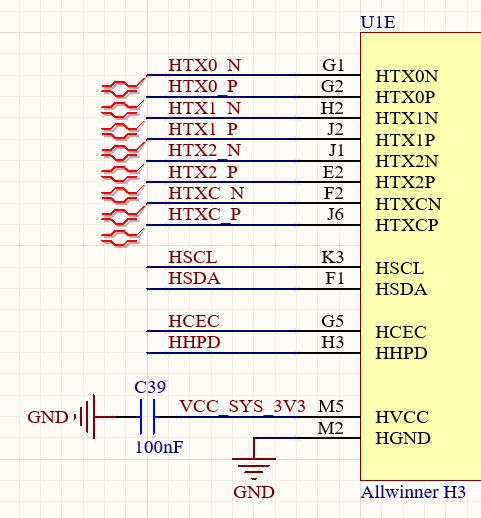
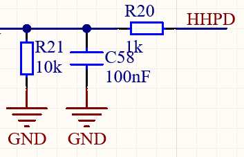

## 前言
开发全志H3的核心板过程中，原理图绘制部分有很多新知识，近期博文将全面介绍全志H3的原理图设计，把这些知识整理下来。本篇主要介绍HDMI——接口的电路设计。
<!-- more -->
## CPU－HDMI设计
### 原理图

如图，CPU侧电路主要包括四对差分对、一对I2C，以及`HCEC`、`HHPD`。下面将分别介绍
### 数据线
`HTX[0:2]`三对差分对是HDMI的数据线。
### 时钟线
`HTXC`差分对是HDMI的时钟线
### 控制线
`HSCL`、`HSDA`这一对类似I2C的线路，是HDMI中，预留用来与显示器通信的线路。可以通过I2C总线读取显示器的分辨率等信息。
`HCEC`是Consumer Electronics Control的简称，他是一个统一的单总线电子设备控制协议，可以通过一根线控制设备进行播放、暂停之类的简单功能。
### 其他
`HHPD`是热插拔检测线。
## 接口电路设计
### 原理图

从原理图中可以看出，HDMI的数据线和时钟线可以直接与CPU相连，对应的Shield引脚应当接入参考电平（GND）。其他的控制线需要一些外围电路辅助。
### HCEC设计

如图，由于HDMI要兼容不同电平的设备，所以HCEC所需要的是一个电平转换电路。`D1`和`R18`两个器件组成上拉电路，之所以添加一个二极管，是为了防止另一设备电路的电压高于本设备，通过这根线倒灌到本设备的电源中。`Q1`和`R19`组成电平转换电路。工作原理如下：
	**左发右收**：当MOS管左侧为低电平时，HCEC通过MOS管体二极管被下拉到0.5V左右。MOS管左侧为高电平时，HCEC可以正常被`R19`上拉到VCC。此时，MOS管不导通，因此可以防止左侧电压倒灌到右侧。
	**左收右发**：当HCEC为低电平时，`Q1`S极电压低于G极电压，因此导通，MOS管左侧被下拉到地。当HCEC为高电平时，`Q1`关断，此时MOS管左侧被上拉电路拉至高电平。
总之，这个电路可以实现双向单总线的通信，而且可以保证本设备的安全。
### HHPD电路设计

HHPD主要实现HDMI插入检测。电路比较简单。
### I2C电路设计

I2C电路本质上也是一个电平转换电路。但是由于I2C接口是开漏输出，所以不需要用到MOS管。HDMI中，Source端作为I2C主机，也就是左侧是I2C主机。当主机释放总线时，右侧被上拉到5V。当主机拉低总线时，为了防止5V电源直接灌入，串联一个22Ω电阻，降低电流即可。
理论上不会出现5V电源灌入的情况，应该都会有上拉电阻，但也不排除某些设备设计缺陷，I2C接口用推挽输出。因此最好还是加上。
### ESD防护电路设计

HDMI通信速率很高，而且都是差分信号，在选择ESD时，最好要选择集成了多对ESD的芯片，同时也要尽可能的减少ESD管结电容。像我选的TI家的ESD管子，单根线的电容低至0.25pF。ESD电路最好还是加上，因为HDMI热插拔过程中有可能产生静电，不加的话容易打坏元器件。
## 总结
HDMI接口设计的时候，需要注意控制线和热插拔的外围电路，既要能够做到正常通信和正常功能，还要考虑到不同设备的不同电平、不同设计对本设备有可能产生的危害，并设计电路防护。