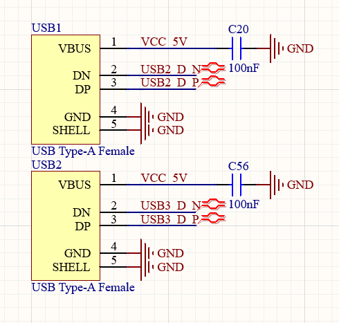
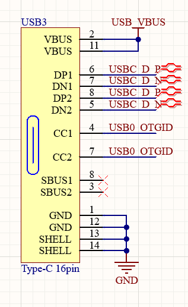
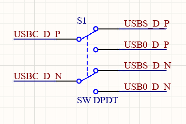
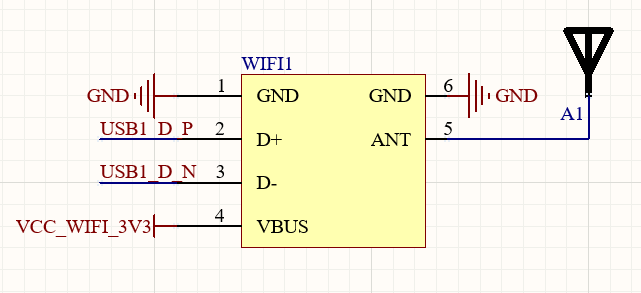
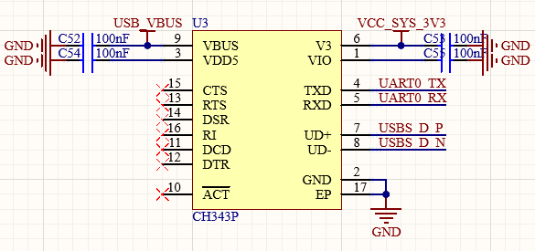

1## 前言
开发全志H3的核心板过程中，原理图绘制部分有很多新知识，近期博文将全面介绍全志H3的原理图设计，把这些知识整理下来。本篇主要介绍USB的电路设计。
<!-- more -->
## HOST部分
USB HOST指的是本设备作为USB主机，对外供电、检测外部连接状态。一般情况下，HOST设备会使用USB Type-A接口连接外部设备。这款掌上电脑设计了两个USB-A接口，作为HOST接口。可以通过HUB转接更多，也可以直接连接键盘鼠标，两个基本就够用了。这两个USB-A接口分别连接到主控的USB2和USB3。

## OTG部分

OTG指的是USB On The Go，是USB协议中既能够作为主机（HOST），也可以作为作为设备（DEVICE）的一种设备，在USB Type-C协议规范中被称为DRP——Dual Role Port。
OTG的本质是`ID`引脚，这个引脚在Micro-USB中存在，但是Type-C中不存在，以`CC1/2`引脚代替。`ID`引脚接地代表该设备为主机，`ID`引脚为悬空（上拉）代表该设备为从机。因此，OTG设备需要不断转换`ID`引脚电平，直到与设备建立正常通信之后，固定住电平，实现OTG双设备身份。
Type-C就比较麻烦。DFP（主机或Source端）的`CC1/2`应当上拉，UFP（设备或Sink端）应当下拉。因此，根据规范，需要切换上下拉电阻的连接，不断转换设备身份，直到建立正常连接为止。不过，如果不断改变`CC1/2`引脚的电平，可以达到一样的效果。因为外部设备一定会有上拉或者下拉电阻，改变电平与改变上下拉状态是一个效果。只不过，如果两个设备都是OTG设备，那么就可能会出现问题。因此，这个电路，只能连接Type-C转A口的线，然后接入其他设备，而且可能只有一面能用。如果是C-C的线，很可能是无法工作的。
实际上，这个接口很可能不会作为HOST端，只会作为DEVICE端。因为这个接口连接了USB转串口的芯片——CH343，只要用到串口，就需要这个接口作为UFP端。不过，为了将所有USB接口都引出，这个口还是设计成了双角色的设备。此外，为了实现串口USB和主控USB的切换，我设计了一个开关可以拨动选择哪一个设备的USB连接到接口。如果连接主控的话，占用主控的USB0。

## USB－WiFi
主控还剩余一个USB接口，我把他连接到了USB-WiFi的模块上面，实现WiFi功能。电路如下。

## USB转串口——CH343

与CH340的不同主要在于通信速率。根据沁恒官网的内容，CH343最高支持到6Mbps的波特率，CH340只支持到3Mbps的波特率。由于我们的主控非常强大，6Mbps的波特率只能说是小菜一碟，而且调试的时候，串口可能会打印很多东西。因此最好选择一个高速USB串口芯片。
VBUS、VDD5应当连接到一起，接入USB VBUS。V3和VIO可以一起接入3.3V，与板上硬件通信。
## 总结
USB的设计比较复杂，主要是由于USB-IF组织规定的协议实在太混乱，各种资料、样例五花八门，没有统一的规范。不过，USB仍然是日常使用最经常的接口，尽可能的还是弄清楚各种USB口的电路设计，方便日常使用。