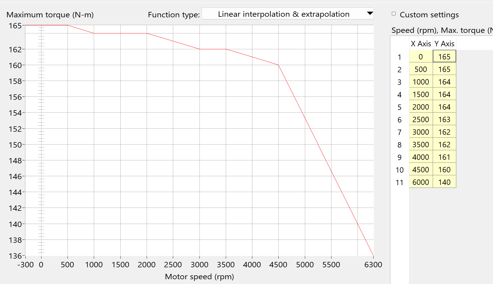

FSEC——中国大学生电动方程式大赛是一个全国性的大学生汽车赛事，参赛队伍自主设计、制造一台方程式赛车参加比赛。这里介绍一下我所隶属的车队共同开发的TCS——牵引力控制算法。

<!-- more -->

## 仿真平台

CarSim是一款强大的汽车仿真、自动驾驶仿真软件，具有真实的物理引擎，能够模拟各类路面、风等环境与各类发动机、变速箱、差速器乃至电动机、电池构成的车辆。使用它可以轻松的构建出一辆赛车模型，而不需要自己开发复杂的运动学模拟算法。

### 机械参数设置
车辆的机械参数，来自于FSAE所公开的一辆原型车模型，基本没有做改动。

### 电气参数设置
电气参数包括三大部分：动力总成、变速器、功率管理。其中动力总成包括电机、电池等。我基于CarSim自带的40kW电机系统开发，修改了一些设置和参数。我没有修改功率管理相关的东西，保持默认了。

1. 动力总成
   1. 电池
   
   按照我们车上的实际参数设置的。
   2. 电机
   
   按照电机手册设置即可
   
   除了这两块，其他的类似于电池内阻、电池容量等参数我都没有设置，保持默认的。
2. 变速器
   按照我们的实际情况，选择了4.4传动比的变速器。

### 环境设置
默认的道路，摩擦系数约为0.9，这个摩擦力非常强大，即使全油门一脚踩下去，仿真里面的滑移率也不到0.1，所以为了显示出算法的效果，我把道路摩擦系数改成了0.5。

### 变量接口设置

输入变量叫做`IMP_M_MOTOR_CMD`，是电动机的输出扭矩指令。输入这个指令就可以改变电动机的输出扭矩

输出变量包括：四个轮子的转速，电机的输出扭矩，右后轮滑移率。其中滑移率数据我没用来做算法，只是验证一下通过轮速计算出来的滑移率是否正确。

## 控制算法

其实这个控制算法非常简单，各位大佬轻喷。

首先，考虑到程序运行的周期是20ms，整个算法也是以20ms的采样率运行的，但是仿真是以50us的步进运行的。

### 滑移率计算

该子模块输入前后轮的转速（m/s），计算出滑移率，随后通过一个离散传递函数后输出。该离散传递函数是一个低通滤波器。

> 记录一下这个低通滤波器是如何设计的。
> 首先，它必须是$\frac{\alpha}{1-(1-\alpha) z^{-1}}$的形式，也就是$\frac{\alpha z}{z-(1-\alpha)}$的形式。在MATLAB里面，对应的是分子`[α 0]`，分母`[1 -(1-α)]`
> α越大，截止频率越高，α越小，截止频率越低。
> $$\alpha = \frac{T_s}{\tau+T_s}$$
> 其中$T_s$为采样周期。

### PID控制

PID输出的是扭矩补偿值，160是车手的踏板输入值，这样就可以补偿踏板给出的扭矩，实现牵引力控制的效果。PID参数如下：

调PID这一步是比较痛苦的。

## 调试思路
TCS开发过程遇到了不少问题
1. 滑移率起不来
   最开始的时候，滑移率一直是很低的数值，代表轮胎抓地力一直很强，这与实车测试结果并不相符。真车跑的时候，一脚油门下去一定打滑，但是仿真没有仿出来。最后只能把道路摩擦系数改为0.5
2. 滑移率滞后
   测试过程中，发现电机的扭矩和滑移率并不对应。电机的扭矩上升后，滑移率过了一段时间后才上升，有一个明显的延迟。这导致PID调节很困难。
   后来拉出来CarSim计算出来的滑移率，发现并不存在这个问题。
   最后定位到问题出在滤波器上。滤波器延迟太大，导致滑移率滞后。

## 测试结果

可以看到，摩擦系数0.5时，效果还是很好的。