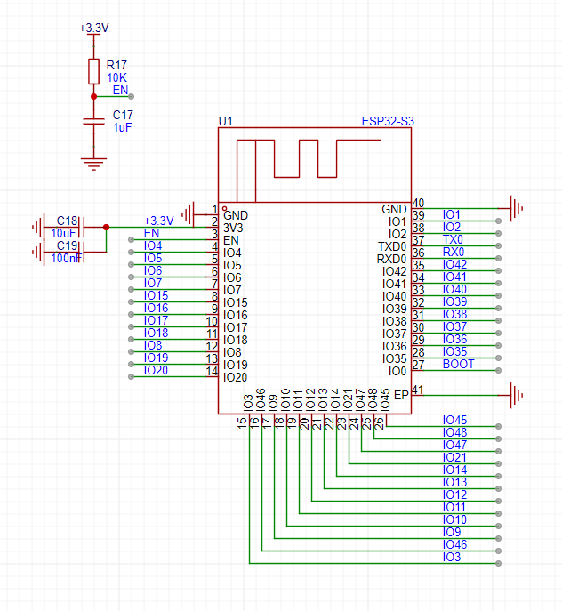
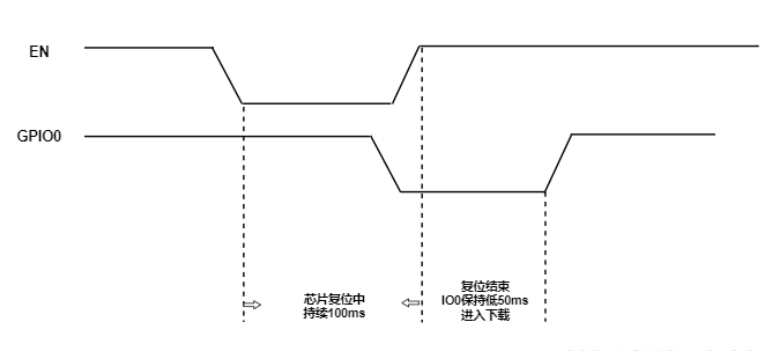
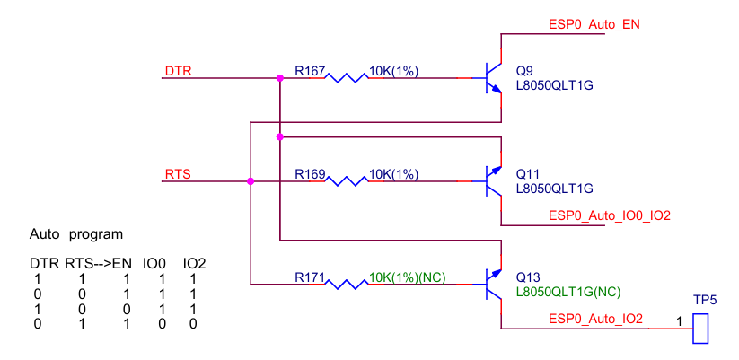

## 前言
按照实验室老师的要求，针对电赛开发一系列开发板，供今年全国电赛的训练和比赛使用。目前主要考虑做音频和信号处理方向的题目。这块板子主要针对音频类题目，基于ESP32-S3，借助ESP32完善的音频生态系统，方便电赛音频题的开发。
本篇博文主要介绍这块开发板的原理图和PCB设计。

<!-- more -->

## 原理图设计
### ESP32模组
考虑到ESP32模组自带PCB天线、外围电路的优良特性，还是采用模组作为主控，不直接使用芯片。

ESP32模组没什么值得讲的。主要是3V3的电源外部去耦电容和EN（RST）的阻容。按照芯片手册的描述，这两块电路最好完全按照推荐参数设计。
### 自动下载电路
自动下载电路本质上是一个USB转串口电路。了解这块电路之前，首先要明白ESP32的启动方式和烧录方式。
#### 启动方式
ESP32的启动方式分为两大种，一种叫做Joint Download Boot模式，另一种叫做SPI Boot模式。我们常用的串口下载、USB下载等，都属于Joint Download Boot模式。而如果想让程序正常运行，就需要让ESP32以SPI Boot模式启动。启动模式与GPIO的关系如下：

|启动模式|GPIO0|GPIO46|
|:-:|:-:|:-:|
|SPI Boot|1|x|
|Joint Download|0|0|

由于这两个管脚能够决定MCU的启动状态，他们有一个专门的名字，叫做Strapping管脚。
此外，GPIO0和GPIO46还具有上下拉电阻。它们的默认上下拉电阻如下：

|管脚|上下拉|
|:-:|:-:|
|GPIO0|上拉|
|GPIO3|N/A|

由此可见，如果想让ESP32能够下载程序，需要把GPIO0拉低。
ESP32启动之后，这些引脚就与普通的IO口一样，可以被程序使用。

#### 下载方式
首先，EN引脚跟其他MCU的RST引脚类似，如果拉低，则会终止MCU的运行，直到再次拉高之后，MCU重新开始运行。也就是说，MCU会重新检测Strapping管脚的状态，并根据Strapping管脚的组合决定启动方式。
那么，为了让ESP32下载程序，我们需要拉低EN，拉低GPIO0，然后再拉高EN，使得ESP32进入下载模式。总的来说，就是让EN拉高时，GPIO0处于低电平。

ESP32官方开发板上的自动下载电路如图。

#### Modem联络信号
这一块值得单开一节，非常复杂。先回顾一下串口的一堆Modem联络信号

|信号|方向|名称|描述|
|:-:|:-:|:-:|:-:|
|CTS|I|Clear to Send|高表示允许本机发送|
|RTS|O|Request to Send|本机发送数据前拉高|
|DCD|I|Data Carrier Detect|高表示其他设备在线|
|DTR|O|Data Terminal Ready|本机可以通信时拉高|
|DSR|I|Data Set Ready|高表示其他设备准备好|

有点乱，不用怕，还有更乱的。这些信号都是针对电脑和Modem通信而言的，有主从之分，而我们用的是CH340之类的USB转串口，涉及的设备包括电脑、CH340、MCU，那到底哪个是终端，哪个是主机？于是乎，这个表格需要重新做一下。

|信号|方向|描述|
|:-:|:-:|:-:|
|CTS|I|高表示MCU允许芯片发送从电脑接收到的串口数据|
|RTS|O|芯片向MCU发送来自电脑的串口数据前拉高|
|DCD|I|芯片不会考虑终端存在与否，所以没什么用|
|DTR|O|芯片接收到来自电脑的串口数据后拉高|
|DSR|I|高表示MCU准备好发送/接收数据|

这还不算完，有的芯片，这些信号是高有效，有些芯片是低有效，比如CH340系列的芯片，这些信号都是低电平有效，也就是说这些描述中的拉高全部要改成拉低，高全部变成低。考虑到所有的因素，最终的表格长这样。

|信号|方向|描述|
|:-:|:-:|:-:|
|CTS|I|低表示MCU允许芯片发送从电脑接收到的串口数据|
|RTS|O|芯片向MCU发送来自电脑的串口数据前拉低|
|DCD|I|芯片不会考虑终端存在与否，所以没什么用|
|DTR|O|芯片接收到来自电脑的串口数据后拉低|
|DSR|I|低表示MCU准备好发送/接收数据|

本来以为事情到这里就结束了，结果事实上，CH340压根不考虑以上的这些因素，RTS、DTR只受电脑控制，电脑让他们拉低就拉低，与数据发送无关。所以，这些联络信号的逻辑，还是要看电脑那边怎么控制它。
整了半天，其实只是理清楚这些名词的含义，并没有什么实际的用处。

#### 下载方式续
有了刚才那么多的铺垫，终于可以开始分析电路了。

首先我们把Q13忽略，与我们的分析下载方式无关。
如果DTR为高电平，RTS为低电平，那么Q9将会导通，将EN拉低。
如果RTS为高电平，DTR为低电平，那么Q11将会导通，将IO0拉低。
如果两个都为高电平或都为低电平，那么Q9和Q11都不导通，EN和IO0维持高电平
通过这些电路，电脑可以通过程序控制DTR和RTS的电平，间接控制EN和IO0的电平，实现自动下载的效果。
这个电路的核心效果其实是把一个IO口的电平同步到另外一个IO口的电平，是为了防止DTR和RTS电平过高损坏单片机。对于CH343P之类有独立的IO口供电轨的芯片来说，可以直接把DTR连接到IO0，把RTS连接到EN，也可以实现自动下载的功能
### 音频编解码器
音频编解码器本质上是一对ADC和DAC，可以把模拟信号转换成PCM编码格式，通过I2S接口输出（编码功能），也可以把I2S传来的PCM数据转换成模拟信号进行输出（解码功能）。我们这块板子使用的是一个ES8311芯片。
ES8311的外围电路完全照抄芯片手册即可，不需要什么特别的设计。需要注意的是，ES8311需要I2S输出MCLK信号，算上DO、DI总共是五根线，可以说把I2S用到极致了。
### 音频功放
音频功放的作用是把DAC输出的音频信号进行电流放大，使其能够驱动更加大功率的喇叭，发出更大的声音。关于功放的内容足够单开一篇文章去写了。这个设计使用的是NS4160 D类音频功放，它的特点是功放效率比较高，适合与我们这种体积比较小的板子
### 其他
#### 电源
使用SY8089芯片产生3.3V电源，它的持续输出电流可以达到2A，配合一个大小合适的2.2uH电感（我用的4030的电感，其实252012应该也够）。值得一提的是，我在电源的EN引脚上增加上拉电阻和按键，可以通过按下按键断掉3.3V电源。有个缺憾是忘了在按键两端并联一个100nF电容起到消抖的作用。
#### LED
增加三个LED，分别是5V、3.3V和用户LED。

## PCB设计
PCB设计没有太多值得关注的。首先这是一个开发板，需要引出尽可能多的引脚用来开发，这就要求ESP32上需要走出很多线，连接到开发板两侧的排针。在连线的时候，建议从排针出发，按照顺序拉出整齐的排线，然后根据排线的顺序，在顶层把ESP32的引脚连出一定长度，越过形成阻挡的线，打上一个过孔，这样每一根线都只需要一个过孔就可以联通，而且排线看起来比较整齐，走线的顺序通过换层实现了重排。
走完所有信号线之后，空间已经很有限了，所以中途改成了四层板，第二层做地层，第三层做电源层。电源层走了两个网络，一个是3.3V，一个是5V。

## 2025.4.24更新 调试
这块板子的调试没有遇到很多的问题，不值得单开一篇讲了。
1. 自动下载电路正常，程序下载很顺利。
2. ES8311与ESP32的通信没有问题，正常输出音频信号，但是忘了引出DAC直接输出额接口，没接功放的情况下没法听效果。
3. 由于使用了CH343P高速USB转串口芯片，我想测试一下超高速的串口能不能实现。由于CH343只接到了UART0，所以只能通过系统debug信息测试。修改debug端口波特率到6Mbps，结果并不理想，烧录失败、输出乱码。修改到3Mbps，烧录和串口输出均正常。
4. WiFi连接顺利。