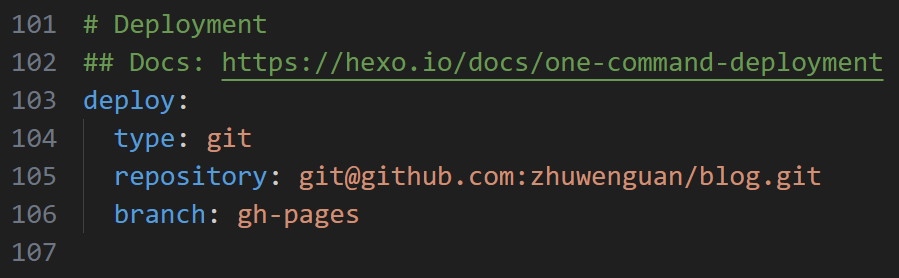
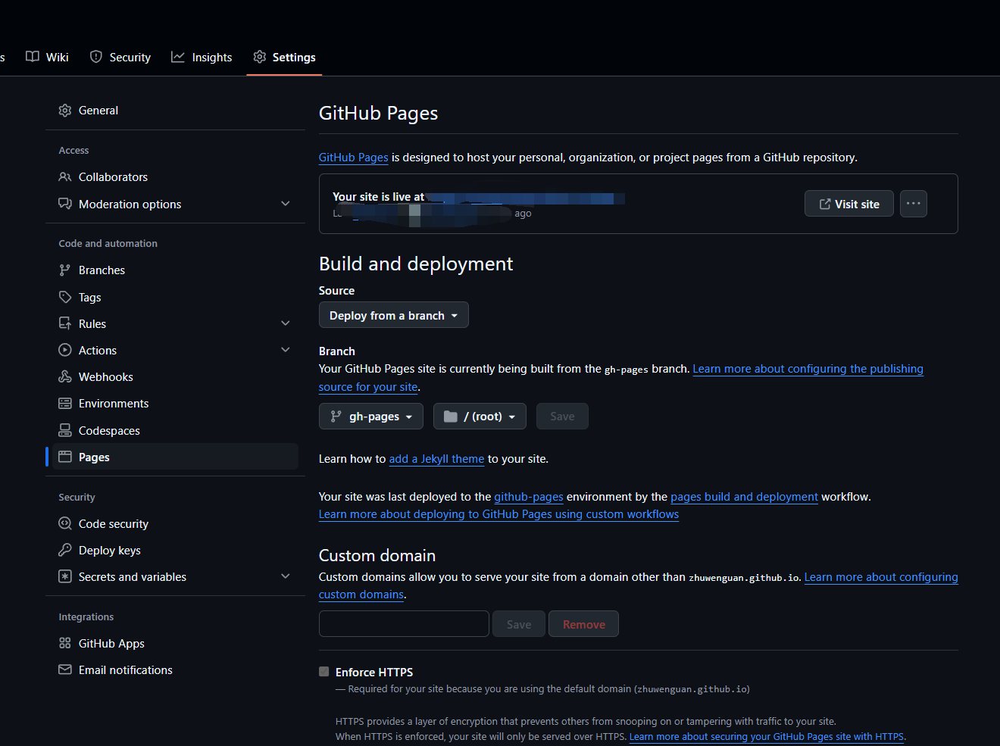
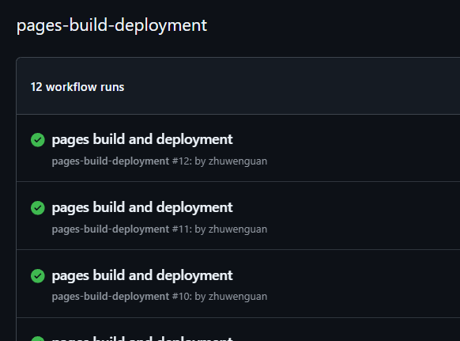
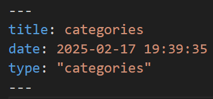

## 前言
由于手中项目逐渐增多，不断地发现自己经常遗忘之前项目的很多细节。比如，代码无法编译后怎么解决、硬件短路后怎么排查、项目开发的注意事项等等。在朋友的建议下，我发现搭建自己的个人博客，用博客来记录自己各个项目的开发过程、遇到的问题和解决方案，作为自己的长期记忆，存放在电脑里，是一个不错的办法。很多大牛也都用自己的博客记录自己项目开发经历，这种方式不仅能帮助自己回忆此前的项目细节，还可以作为自己的展示平台，把自己的能力通过实打实的项目展现出来，同时，这些博文对刚入门的小白也会有很强的指导作用。之前我就访问过稚晖君的个人博客，感觉受益匪浅，涨了很多见识。
综上，我也开始搭建自己的个人博客。实话讲，个人博客的搭建，网络上的教程多如牛毛，基本上跟着做就不会有什么问题。但是，我自己的方案是整合了十几篇教程，结合一些新技术和思路，实现了方便、快捷的博文撰写，美观实用的博客浏览。
废话到这里就结束了。下面开始正文。
本篇博文将详细地介绍自己搭建个人博客的全过程。我的博客基本框架是使用hexo，这是一个非常常用的个人博客框架，可以设置多种主题，实现许多定制功能，并且部署也比较简单。服务器直接使用Github Pages，免费，而且不需要备案，但是国内访问可能会出现缓慢、卡顿等问题，每个人的访问情况也都不太相同，不如使用阿里云等云服务器搭建来的稳定。

## 构思
hexo搭建博客有很多好处，但基本上都是针对访问者而言的。比如，他的界面简洁漂亮，归档分类都很好找，浏览体验也很好之类的。但是，hexo的一大缺点就是写作过程不算是很优雅。原因主要在于，hexo需要在命令行执行新建博客操作，然后在Markdown编辑器里面写好文章之后，回到hexo命令行，执行`hexo g && hexo d`指令，以部署静态页面到Github Pages网页上去。这个过程不够优雅，命令行的操作显得非常原始，既不好几页不好用。为了解决这个问题，同时也借鉴了网络上的解决方案，基本思路就是把源码（博客文档）提交到Github上去，让Github自己执行部署程序，这样就省去了自己去hexo命令行输入指令的过程，可以便捷的撰写和修改。写完的博客直接同步的Github上去，网页端就会自动出现新写的博文了。

有了这个思路，那么具体的技术架构该怎么搭建呢？本地的hexo只用于初始化源码的生成，后续的博客撰写工作不需要使用hexo命令，可以直接在文件夹里新建一个markdown格式的文件就可以。Github上新建一个库，master分支用来保存hexo的源码，这一部分与本地是保持同步的，新建一个gh-pages分支用于储存静态页面文件，使用Github Action把master分支的内容编译、生成静态页面，更新到gh-pages分支，然后Github Pages会自动运行一个action把gh-pages的文件部署到服务器，即可被公网访问打开。

## 搭建步骤

### 准备工作
首先，电脑上需要安装Git。后续的本地云端源码的同步工作都依赖于这个环境。其次，电脑上需要安装node.js，是hexo的前置环境。安装时要勾选添加到PATH，安装完成之后重启电脑。
### 安装hexo
打开一个命令行，先输入
```bash
node -v
```
确认node安装无误之后，输入
```bash
npm install hexo -g
```
这样，就安装好了hexo
### 初始化源码
在想要存储hexo源码的地方打开一个命令行，输入
```bash
hexo init
```
### 本地预览
同一个命令行，输入
```bash
hexo g #生成静态页面
hexo s #启动服务器
```
根据提示，在浏览器中输入`http://localhost:4000`，即可访问本地网站。
### 部署设置
还是那个命令行，输入
```bash
npm install hexo-deployer-git --save
```
打开博客目录下的_config.yml，拉到最后，填写deploy模块

这一串填写的意思是，hexo部署的时候，会以git部署到指定的repository里面的指定branch。使用这种方法部署的前提是本机git具有该repository的访问权限，需要提前设置RSA密钥之类的东西。
设置完这一部分之后，如果输入`hexo d`命令，就会把静态页面部署到github上。
### Github设置
按图设置。核心是选择Source为Deploy from a branch（默认就是这个选项），然后选择gh-pages作为静态页面的branch。

一切正常的话，设置好这一部分之后，在hexo命令行中输入`hexo d`，Github接收到push请求后，就会自动开启一个名为"pages-build-deployment"的action。

### 自动部署
如前文所述，自动部署的核心是上传hexo源码，然后让github自动执行一个action，把源码编译成静态页面，并推送给gh-pages。那么，我们只要写出一个action，完成上面的工作，就可以了。
以下是action的代码
```
name: Build and Deploy

on:
  workflow_dispatch:
  push:
    branches:
      - master

jobs:
  build:

    runs-on: ubuntu-latest

    strategy:
      matrix:
        node-version: [22.x]

    steps:
    - uses: actions/checkout@v4
    - name: Install npm
      run: |
        npm install
        npm install hexo-cli -g
        npm install hexo-asset-img --save
    - name: Prepare Github Identity
      env:
          HEXO_DEPLOY_PRI: ${{secrets.SSH_PRI}}
      run: |
        sudo timedatectl set-timezone "Asia/Shanghai"
        mkdir -p ~/.ssh/
        echo "$HEXO_DEPLOY_PRI" > ~/.ssh/id_rsa
        chmod 600 ~/.ssh/id_rsa
        ssh-keyscan github.com >> ~/.ssh/known_hosts
        git config --global user.name zhuwenguan
        git config --global user.email 170981799@qq.com
    - name: Deploy Blog
      run: |
        hexo g&&hexo d
```
至此，hexo+Github Pages部署个人博客的步骤就结束了。

## 杂记

### 添加分类和标签
在hexo中输入`hexo new page categories`，即可新建一个名为categories的文件夹。里面的文件打开之后，添加“type: "categories"”。如下。

### post和page用不同的布局
hexo的模板是有顺序的，最高级是_config.post或_config.page，其次是config.<theme>，最后是_config.yml。所以只要新建_config.post和_config.page，分别设置post和page的页面布局即可。
附：自己的_config.post设置
```css
widgets:
    -
        type: categories
        position: left
    -
        type: recent_posts
        position: left
    -
        type: toc
        position: right
```