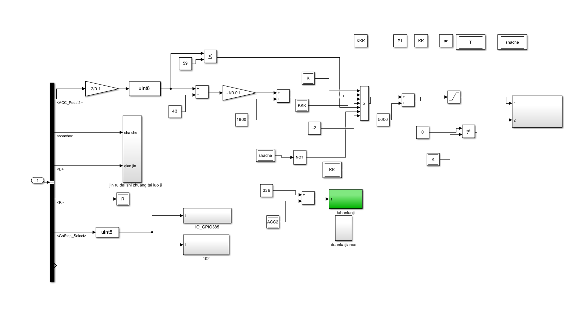
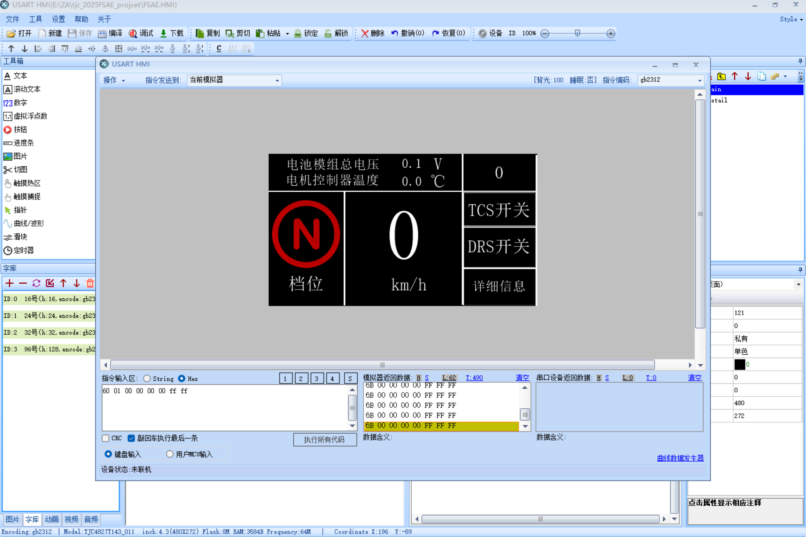
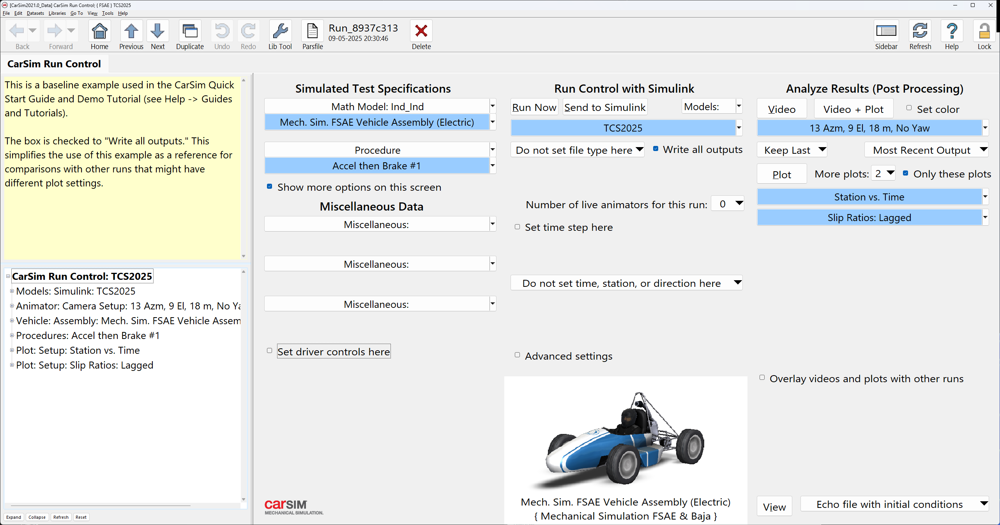
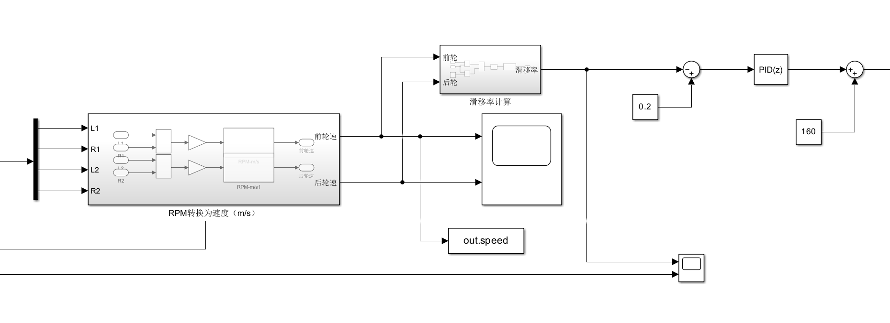
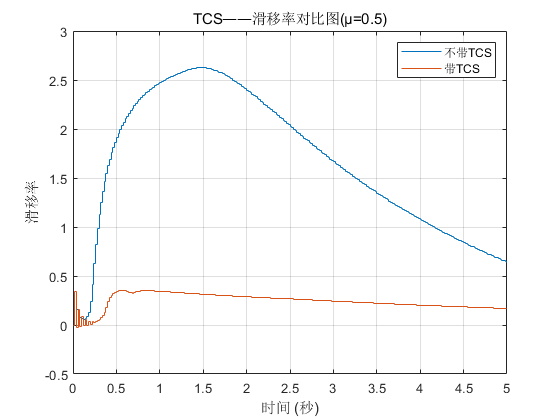
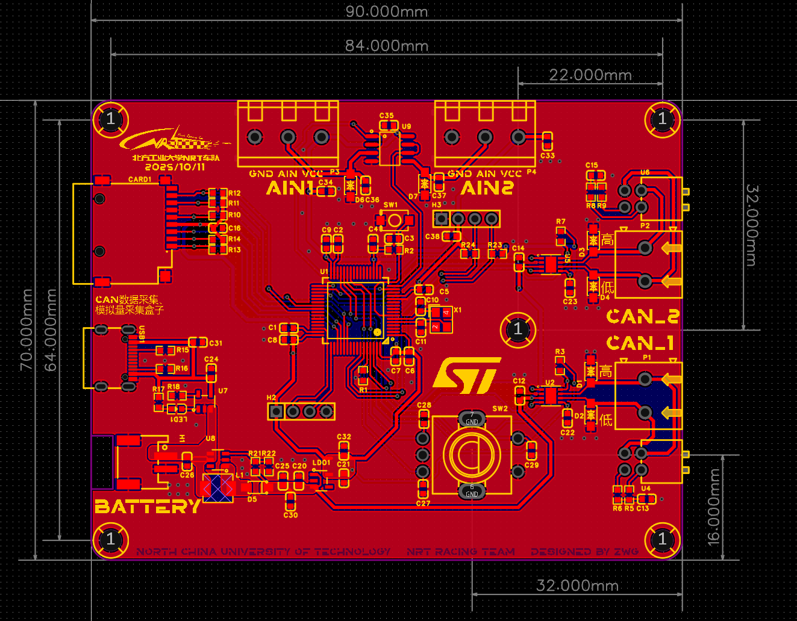
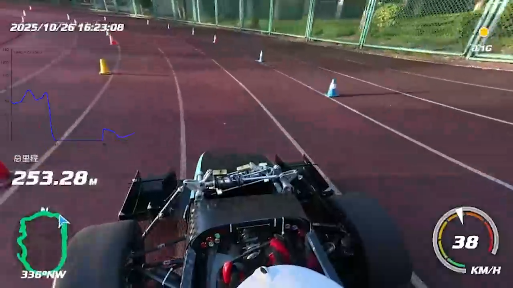

FSEC2025控制部分答辩准备
<!-- more -->

### 往年情况

控制领域一直是NRT车队的一大弱项。往年NRT车队的控制策略长期停留在：驱动系统激活、待驶状态管理、加速踏板指令等能让车跑起来的最基本功能。由此带来的问题是：
1. 车辆动态性能没有完全发挥
   由于缺乏完善的扭矩控制、牵引力控制算法，车辆动态性能下限低，上限过于依赖车手操控。
2. 车手对赛车状态没有客观的感知
   车手无法实时了解如当前扭矩、系统温度、故障标志、能量状态等信息，只能依靠体感判断车辆状态。影响驾驶表现。
3. 车辆调试过程中，缺乏必要的信息显示
   调试阶段缺乏实时数据监控、信号可视化等信息显示，导致调试过程中无法快速排查问题，效率极低。
4. VCU对整车控制能力弱
   原本可以由VCU控制的信号，由于无法修改程序，只能由硬件电路控制，增加了整车电气系统复杂度。

### 追根溯源
为了进一步分析控制系统长期薄弱的根本原因，我们从团队管理、技术能力和硬件基础三个维度进行了梳理，总结如下：
1. 车队管理问题
   VCU开发在车队成员换届过程中断档。新成员没有得到培训，无法开发VCU程序
2. 算法开发经验缺失
   车队成员缺乏算法开发的经验，无法应用Simulink实现所需的功能。
3. 信息采集量少
   赛车安装的传感器数量少，且数据没有被有效保存和使用
4. 信息显示量少
   屏幕只显示极少的数据，车手无法获取足量的信息

### 技术路线
为了解决车队在控制领域存在的问题，我们在今年的研发之始，就制定了控制策略开发的技术路线。
分为短期目标和长期目标。
#### 短期目标：找回VCU开发流程
1. 从0开始，研究VCU开发流程
2. 重写VCU程序，验证VCU开发流程的有效性。

在上述流程顺利的情况下：
1. 重做仪表，设计全新的UI，显示更多信息
2. 重新标定油门踏板
3. 重新标定电机扭矩，以适应整车动态性能
#### 长期目标：实现高级控制策略和算法
分为三条支线：
1. 仿真开发算法
   1. 建立并验证CarSim车辆模型
   2. 基于CarSim和Simulink联合仿真，开发牵引力控制算法
   3. 开发针对不同动态项目的策略
2. 完善车辆传感器
   1. 开发轮速传感器
   2. 开发悬架行程传感器
   3. 开发转向角传感器
3. 实现车辆数据采集
   1. 实现CAN总线报文采集
   2. 实现传感器数据采集（独立于整车）

### 开发成果

#### 1.VCU程序开发
今年，NRT车队从0开始，将VCU程序从编写、转译、编译、下载的全流程研究明白。
梳理了之前VCU程序的信号流，将原来的程序进行了大量优化，既提高了性能，也方便了开发和管理。
##### 原来的程序

##### 新开发的程序

#### 2.全新的仪表
将整个屏幕全部替换掉，重新做了一套仪表，增加了很多显示的内容。

#### 3.CarSim与Simulink联合仿真
我们基于FSAE公开的一辆赛车模型，根据我们赛车的实际情况进行修改，建立了一个CarSim模型，用于控制算法的验证。

#### 4.TCS算法仿真开发
基于Carsim和Simulink，在仿真中，开发了一套TCS算法。
使用前轮速和后轮速计算滑移率，根据实际滑移率与目标滑移率之差，应用PID算法，实现扭矩补偿。
##### TCS算法截图

##### TCS算法效果

#### 5.轮速传感器
TCS系统如果想要上车，必须有轮速作为原始数据。因此今年传感器开发的首要目标就是轮速传感器。我们用霍尔传感器，在轮边上安装带有凸齿的不锈钢圆环，让传感器感应磁场信号，产生频率可变的矩形波形。VCU采集矩形波的频率，就可以计算出轮胎的转速。

#### 6.数据采集盒
为了实现基本的数据采集，我们自主开发PCB和程序，做了一套完全符合我们需求的数据采集盒。

采集到的数据保存到SD卡里面，后续在电脑上进行处理，可以生成一个类似于这样的表格。

利用这些数据，我们还做了一些很酷的事情

油门开度的曲线，和车载视角结合在一起，生成了一条视频，可以帮助车手训练，也可以帮助调整车辆设定，也可以作为算法优化的参考。
对于任何一支成熟的电动方程式车队而言，最理想的数据获取方式无疑是实时遥测。但是这个数据采集盒，是在设备、经费有限的情况下，采集实车数据的一次大胆尝试。这一次创新，让我们首次能够采集车辆跑动的实时数据，让我们车队脱离了“盲调”，实现了基于数据的车辆调试，把NRT电车的科技化、数字化程度提高到了新的层级。