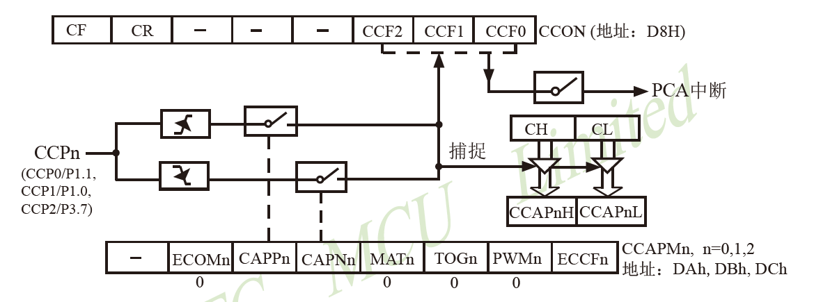

## 前言
最近准备给班里同学介绍一下蓝桥杯单片机的比赛经验，把我去年自己研究的单片机比赛常用的编程技巧分享给大家，提升编程效率和效果。本篇文章同步介绍有关内容，顺带作为教案，方便PPT制作。
<!-- more -->
## 概述
蓝桥杯使用的单片机芯片型号是IAP15F2K61S2，属于STC15F系列，是STC15F系列的最高级别芯片。他还有一个姊妹芯片叫做STC15F2K60S2。两颗芯片几乎一模一样，最大的区别是前者支持单芯片在线仿真调试，后者不支持。所以，编程的时候，如果找不到IAP15F2K61S2的相关资料，可以直接用STC15F2K60S2的，他们的外设、内核都一样，代码是互通的。
蓝桥杯单片机主要考察的点有：IO口操作、I2C总线、One-Wire总线、计数器/定时器、芯片自定义总线、UART串口等。下表详细介绍这些知识点所对应的功能：

|   知识点    |  外围芯片   |    功能     |
| :------: | :-----: | :-------: |
|  IO口操作   |    \    |   按键扫描    |
|  IO口操作   | 译码器、锁存器 |   数码管显示   |
|  IO口操作   | 译码器、锁存器 |    LED    |
|  IO口操作   | 译码器、锁存器 |    蜂鸣器    |
|  IO口操作   | 译码器、锁存器 |    继电器    |
|  I2C总线   | PCF8591 |   电位器输入   |
|  I2C总线   | PCF8591 |   光敏电阻    |
|  I2C总线   | PCF8591 |   DAC输出   |
|  I2C总线   | AT24C02 |  EEPROM   |
| One-Wire | DS18B20 |   温度检测    |
|   计数器    |  NE555  |   频率检测    |
|   定时器    | CX20106 |   超声波测距   |
|   特殊总线   | DS1302  | 实时时钟(RTC) |
|  UART总线  |    \    |   上位机通信   |

近年的蓝桥杯题目，基本上会同时考察上面所有内容。而且不同的功能之间会有联系，比如，数码管实时显示NE555的频率，频率大于10kHz后，让某个LED亮起。有些题目会掺杂一些情景描述，比如去年国赛融入了一个无人探测车的背景，需要一些坐标的计算。
我只想讲几个比较困难的，频率检测、温度检测、超声波测距，以及自己的心得体会。其他的比如数码管、LED之类的，自己去网上搜索或者B站看课就行，我就不讲了。

## 基础代码框架
蓝桥杯的代码写起来还是比较困难的，主要是因为任务比较多，而51单片机的计算速度又慢得很，所以每个任务都会占用不少时间。时间与算力是直接相关的。如果一个任务计算完成需要很多时间，那么就代表他的计算需要很多的算力。所以优化代码主要就是优化时间。
这么多任务，代码怎么样安排呢？很多网上的模板都是这样写的：
```c
void main()
{
	初始化1();
	初始化2();
	...
	while(1)
	{
		任务1();
		任务2();
		...
		Delay1ms();
	}
}
```
我不建议使用`while(1)`作为程序的主循环。首先，任务执行的时间并不是固定的，有可能第一次执行这个任务的时候，所用时间比较短，第二次执行的时候用的时间比较长。那么就会导致第一次循环和第二次循环总时间不一样。这就容易导致数码管亮度不均匀之类的问题。其次，这样写，没有办法控制整个代码的运行速度。如果里面的任务执行速度很快，那么循环就很快，但是我们压根不需要这么快的速度；如果里面的任务执行很慢，就会发现整个系统都被拖慢了，我们无法定位具体是哪个任务拖慢的速度，也无法主动的干预。第三，由于这样写无法确定程序执行的时间，很难做出软件PWM或者LED定时闪烁之类的功能。
去年我参赛的时候，练习的所有代码都是用定时器中断作为主循环的。定时器中断是定时器溢出的标志，通过设置定时器的初值和自动重装载值，可以改变它溢出的时间。STC-ISP里面有专门的定时器计算工具，可以让定时器以任意时间间隔溢出，产生中断。比如，我常用的是用1ms的定时器中断。每次产生中断时，开始执行代码。比如这样：
```c
void main()
{
	初始化();
	while(1);
}
void Timer0_Interrupt() interrupt 1
{
	SegCalc();     //计算数码管显示值
	SegRefresh();  //刷新数码管
	KeyScan();     //按键扫描
	任务1();
	任务2();
}
```
而`main`函数里面只执行初始化代码。执行完之后直接`while(1);`无限等待。
这样写的好处就是，每一次进入中断的时候，都是上一次进入中断的1ms之后，时间非常准确。那么，数码管刷新、按键扫描等基本功能的刷新率都是稳稳的1kHz，不会因为其他代码执行导致刷新率变化，也就不会有闪烁、亮度不均等问题。
这样写也有一个问题，就是在中断当中执行的代码，时间不能太长。因为中断是1ms进入一次，如果中断代码执行时间大于1ms，那么上一次中断还没执行完，下一次中断又来了，整个程序就会被卡住，无限进入中断，永远执行不完代码。这就是我们认为的“跑飞了”。
所以这么写，一定要保证执行的时间不要大于1ms。那如果执行时间大于1ms咋办？最简单的办法就是，把定时器中断时间从1ms改成2ms，这样代码执行时间只要小于2ms就行了。不过这个数不是随便加的，51单片机定时器中断的时间理论最大值是
$$
t_{max}=65536×\frac{12}{12×10^6}=0.065536s=65.536ms
$$
这是在定时器设置为12T的情况下。
65ms的刷新速度其实是有点慢的，一般10ms我觉得是算是可以接受的最大时间了。这个时间很充裕的，如果你的代码无法在10ms内执行完的话，就该考虑一下优化代码了。
有同学会问了，如果我的代码不是1ms执行一次，而是1s执行一次，比如让LED闪烁。那这个定时器中断每次都是1ms，怎么办？
```c
//1ms @ 12.000MHz
void Timer0_Interrupt() interrupt 1
{
	static unsigned int cnt;
	cnt++;
	if(cnt >= 1000)
	{
		cnt = 0;
		任务();
	}
}
```
这样写，任务就是1s执行一次了。这样写你会发现，1s内的大部分时间，代码只执行了cnt++，没有干别的，只有cnt到了1000的那一次，才会执行任务。这种代码我们成为非阻塞式代码，没有到它执行的时候，就跳过，不在它身上浪费时间，只有它需要执行的时候，才会执行。非阻塞式还包含执行的过程是否阻塞，这里不讨论了。
## 温度检测
### 难点
之所以把温度检测放在定时器中断后面，就是因为，温度检测对定时器中断来说是个灾难。温度检测所用的DS18B20芯片是单总线芯片，单总线的特点就是慢。比如，它的初始化需要拉低460us，如果我们用1ms的定时器中断的话，一个初始化一半时间没了，这还没开始读取呢。后面读取的速度也是慢的离谱。如果把温度检测的任务加入定时器中断，那么100%会跑飞。
### 解决方法
首先，直接读取是不可能的了。其次，如果像刚才那样，加上一个`cnt`，一段时间执行一次，可以不可以呢？可以，但是不好。那样的话，视觉上会发现数码管有固定时间的卡顿，一会卡一下一会卡一下，整体流畅度还是不好，而且刷新率慢。我的做法是，分步执行。
具体来说，DS18B20读取分8步，初始化，发送跳过ROM校验指令，发送开始转换指令，重新初始化，发送跳过ROM校验指令，发送读取数据指令，读取数据1，读取数据2。每一步都有严格的时间限制，但是两步之间的间隔没有严格的限制。因此，我把它分步执行，每一次定时器中断只执行其中一步，由于定时器中断会不断进入，最终还是可以把所有步骤走完。这样每一个定时器中断都不会因为读取温度占用太长时间，就可以避免温度读取导致整体混乱。
### 示例代码
```c
float DS18B20_ReadTemp()
{
	float temp1;
	unsigned char byte1, byte2;
	static unsigned char step;
	switch(step)
	{
		case 0:
			DS18B20_Init();break;
		case 1:
			SendByte(DS18B20_CODE_SKIP_ROM);break;
		case 2:
			SendByte(DS18B20_CODE_START);break;
		case 3:
			DS18B20_Init();break;
		case 4:
			SendByte(DS18B20_CODE_SKIP_ROM);break;
		case 5:
			SendByte(DS18B20_CODE_READ);break;
		case 6:
			byte1 = ReadByte();break;
		case 7:
			byte2 = ReadByte();break;
	}
	step++;
}
```
这里面的每一步自己再实现就可以了。蓝桥杯的数据包里面有相应的代码。

## 译码器、锁存器操作
译码器和锁存器搭配起来，可以把P0口复用，同一个P0口控制四个不同的功能，分别是LED，数码管位选，数码管段选，达林顿管阵列（蜂鸣器、继电器、步进电机等）。用P25、P26、P27三个IO口控制3-8译码器，进而控制锁存器的锁存状态，使得P0口的数据发送到不同地方。
下面这个表格介绍了三个口不同电平对应的功能
|P27|P26|P25|Y|P0口功能|
|:-:|:-:|:-:|:-:|:-:|
|1|0|0|4|LED|
|1|0|1|5|达林顿阵列|
|1|1|0|6|数码管位选|
|1|1|1|7|数码管段选|

Y代表使能的锁存器序号。
这块是基础，但是容易出问题。我当时练习的时候，经常能够碰见LED干扰数码管、数码管干扰达林顿等情况。比如，LED0需要亮起，但是数码管并不需要亮，结果每个数码管的同一段都有点微微亮。或者LED不需要亮，数码管需要，但是LED会微微亮。或者数码管最后一位显示的内容会重影在第一位数码管上......这些都是译码器没有写好导致的。
比如说，如果现在P2的三个口从高到低分别是111，即处于数码管段选状态。接下来，我想要改成控制LED，即改成100。那么我可能写出以下代码：
```c
P25 = 0;
P26 = 0;
```
如果这样写就出问题了。因为第一句执行完之后，P2的三个口变成了110，也就是控制数码管位选。换句话说，我本来想要控制LED的，但是在改变P2口过程中，顺带改变了数码管位选。那么就会导致不属于这一位数码管的数据显示到上面去。但是由于马上就会把P25置1，所以数码管位选只被控制一瞬间，后面可能会被正确的数据覆盖掉，因此只会人眼看起来是一个不太亮的虚影。
为了解决这个问题，我建议每次更改3-8译码器状态，也就是更改P2的三个口状态的时候，都遵照以下的顺序：
```c
void LatchControl(unsigned char latchNum,unsigned char latchCode)
{
	P0 = latchCode;				//改变P0的值
	P25 = latchNum & 0x01;		//先赋给P25
	P26 = latchNum >> 1 & 0x01;	//然后赋给P26
	P27 = latchNum >> 2;		//最后给P27
	P27 = 0;					//马上清零，失能所有锁存器
	P26 = 0;
	P25 = 0;
}
```
这样写是因为，我们只用到了4567四个锁存器，也就是说，不管控制哪个锁存器，P27都是1。那么只要P27不是1，四个锁存器都不会被控制。因此，`P27 = 0;`就可以失能所有锁存器，也就不会互相干扰了。所以控制的时候，先改变P25、P26的值，最后让P27为1，而清零的时候，先清零P27，然后再清零P25、P26，这样就能避开所有干扰。
## 频率检测
### 原理
NE555是一个方波发生器，根据不同的外围电路，可以产生不同频率、不同占空比的方波。蓝桥杯的这块板子上面，NE555会产生可变频率的方波，频率由板子上的旋钮决定。旋钮就是电位器，通过改变电阻的大小改变方波的频率。方波频率的范围大概是几十赫兹到35000Hz左右。
硬件上，NE555的输出可以通过一个跳线帽连接到单片机P34口，P34可以设置成Timer0的脉冲捕获输入。利用Timer0的脉冲捕获，可以对P34口的脉冲进行计数，进而求得频率的大小。
频率的含义，是一秒时间内信号的周期数，因此，求频率有两种方案，一种是定数计时，比如测量信号100个周期用了多少时间，然后计算得到频率。另一种是定时计数，比如定时1s，测量信号跳变了多少个周期，得到频率。
对于单片机来说，定时计数方案比定数计时方案要简单很多，但是效果比较差，刷新率不高。定数计时方案效果非常好，刷新率飞快，比官方的示例程序效果还好，两种方案都可以学习一下。
### 定时计数方案
定时计数的基本原理，就是数出一段时间内，信号经过了多少个周期。假设我们数200ms，这200ms内数了130个周期，那么一秒钟的时间，就应该会有$130×\frac{1000 ms}{200 ms}$个周期。这样就检测出来了信号的频率。
如果数200ms，那么显然结果的刷新率就是5Hz，因为1s时间最多数5轮。所以，数据的刷新速度是很慢的。这样数还会带来另一个问题，根据刚才的公式，得到的频率是$130×5$，也就是$Counts×5$，而$Counts$肯定是整数，所以得到的结果，肯定是5的倍数。反映在效果上，就是得到的频率，全都是5的倍数，没有1234、6789，测量的精度很低，这个效果显然很差。
想要解决这个问题，也简单，数1s时间内的周期数，就可以了。因为1s时间的周期数直接就是频率，不用乘一个系数，所以精度能够保证是1Hz。但是这样的话，刷新率比刚才200ms更低了，数1s时间，也就是说1s才刷新一次数据，刷新率很低。
虽然刷新率很低哈，但是蓝桥杯的评委不看刷新率，所以这样也是可以的，分数能拿到。效果只是满分的基础上精益求精的东西。

$$
精度=\frac{1s}{采样周期}
$$

随便写了点实例代码，大概看看思路就可以。
```c
//Timer0 外部计数模式
void Timer0_Init()
{
	AUXR = 0x80;		//定时器时钟1T模式
	TMOD = 0x04;		//设置定时器模式
	TL0 = 0;			//清除初始值
	TH0 = 0;
	PT0 = 1;			//T0中断优先级设为最高
	TR0 = 1;			//开始计数
}

void FreqCalc()
{
	static unsigned int freq;
	freq = (TH0 << 8) + TL0;
	TL0 = 0;
	TH0 = 0;
	//下接数码管更新代码
}

//1ms @ 12.000MHz
void Timer1_Interrupt() interrupt 3
{
	static unsigned int cnt;
	cnt++;
	if(cnt >= 1000)
	{
		cnt = 0;
		FreqCalc();
	}
}
```

### 定数计时方案
定数计时方案是我认为非常好的一个方案。它的原理与定时计数不同，他是测量固定周期数的时间，比如测量10个周期的时间，得到每个周期，求倒数得到频率。实际应用当中，一般会取一个周期，也就是方波的两个上升沿之间的时间差，得到单周期的时间，求倒数即可。为了测量一个周期的时间，我们必须采用第二个定时器进行计时，因为Timer0必须用来做上升沿捕获，不能计时，就必须用另外一个定时器计时。这个方法计算的频率非常精确，可以达到小数级别。但是也有一定的限制。
首先，由于NE555产生的方波周期不太稳定，用这个方法测出来的频率是实时刷新的，一个数据对应一个周期，所以数据跳变会比较厉害。简单求平均就可以解决这个问题。
其次，这种方式所测量的频率有上下范围的限制。这个范围限制主要来自于单片机计时的精度限制。单片机内部计时，本质上还是计数，单片机对内部的高速时钟（12MHz）计数，因此一个数就代表$\frac{1}{12×10^6}s$。这样就用计数的方式间接实现了计时。但是这样计时的最小时间间隔就是$\frac{1}{12}s$。所以，如果测量的频率非常高，一个周期的时间小于最小时间间隔，那么就无法计时了。据此算出的可测量最高频率为
$$
f_{max}=\frac{1}{\frac{1}{12×10^6}}=12MHz
$$
这个数显然是远大于我们板子上NE555能产生的最高频率的。
最低频率也是有限制的。定时器最大只能计65536次，也就是$65536×\frac{1}{12×10^6}=0.0055s$，如果信号比较慢，一个周期的时间大于这个数，定时器就会满，就测不出来了。这个问题很好解决，如果定时器溢出，那么就把定时器清零，然后重新计，最后算时间的时候，加上溢出之前的0.0055s就可以了。溢出几次，就加几次时间。所以最低频率可以通过算法无限降低，相当于没有限制。
不过，还有一种方法我更推荐使用。STC15的定时器可以设置成1T或者12T模式，分别代表一个时钟记一次、十二个时钟记一次。刚才所有的计算都是基于1T模式计算的。如果用12T模式计算，那么得到的最大最小频率分别为：
$$
f_{max} = \frac{1}{\frac{12}{12×10^6}}=1MHz\\
\qquad\\
f_{min} = \frac{65536}{\frac{12}{12×10^6}}=15.26Hz
$$
这个范围非常完美的覆盖了NE555能够产生的频率范围，所以不需要算法上做什么优化，就可以测量出所有的频率。
示例代码如下：
```c
void Timer_Init()
{
	AUXR = 0x40;			//定时器时钟1T模式
	TMOD = 0x04;			//设置定时器模式
	TL0 = 0xFE;				//两次脉冲
	TH0 = 0xFF;
	TL1 = 0x50;				//设置定时初始值
	TH1 = 0xFB;				//设置定时初始值
	TL2 = 0;
	TH2 = 0;
	TF1 = 0;				//清除TF1标志
	TR1 = 1;				//定时器1开始计时
	ET1 = 1;
	ET0 = 1;
	TR0 = 1;
	PT0 = 1;				//中断优先级最高
}

void FreqCalc()
{
	static unsigned char calltimes,i;
	static unsigned long int freqs[10];
	
	calltimes++;
	
	if(calltimes >= 20)
	{
		calltimes = 0;
		freqs[i] = 2000000 / freqValue;		//频率计算公式
		i++;
		if(i > 9)
		{
			i=0;
		}
		freq = (freqs[0]+freqs[1]+freqs[2]+freqs[3]+freqs[4]+freqs[5]+freqs[6]+freqs[7]+freqs[8]+freqs[9]) / 10;	//取平均
	}
}

void FreqA()
{
	AUXR &= 0xEF;	//关闭Timer2
	freqValue = (TH2 << 8) + TL2;
	TH2 = 0;
	TL2 = 0;
	AUXR |= 0x10;	//开启Timer2
}

void Timer0_Interrupt() interrupt 1
{
	FreqA();
}
```
## 超声波测距
超声波是近两年才出的考题。难度不亚于频率检测。首先讲原理。
### 原理
超声波从发射到接收需要一定的时间，这段时间是超声波传播到障碍物再返回的时间，而超声波的速度就是声速340m/s，因此根据超声波反射回来的时间，就可以测量出板子距离障碍物的距离。
$$
dist = v_{sonic} × \frac{t}{2}
$$
单片机可以通过给P10一串脉冲信号来发送超声波
```c
void DistDetectStart()
{
	for(i=0;i<5;i++)
	{
		P10 = 1;
		Delay10us();
		P10 = 0;
		Delay10us();
	}
}
```
如果CX20106接收到了间隔10us的脉冲，那么他会给单片机一个脉冲，代表接收到了正确的数据。这个脉冲可以被单片机P11口接收到。
因此，只要测量从发送一串脉冲信号，到P11口接收到脉冲信号的时间，就可以测量出$t$
### 计时方法
网上有很多方案都是用定时器实现的定时，但是这个方案不好，STC15这款MCU总共只有三个定时器，基础功能+频率检测正好全部用掉，没有寄存器给他用了。
一个比较简单的计时方法，是借助单片机内部的CCP模块。CCP——Capture/Compare/PWM模块，这个模块可以有三个功能，分别是捕获、比较、PWM。我们主要用他捕获的功能。下图是捕获功能的模式图

`CL`和`CH`是一个计数器的低八位和高八位，`CCPn`是外部输入管脚。如果`CCPn`管脚检测到了上升沿（或下降沿），则会触发一次捕获，把`CH`和`CL`的值存储到`CCAPnH`和`CCAPnL`里面，同时触发PCA中断。
因此，只要在发射超声波之后，开启`CH`和`CL`的计数，在PCA中断中，读取`CCAPnH`和`CCAPnL`的值，就可以知道从发射超声波到接收到超声波的时间。
`n`代表PCA通道的序号，我们使用PCA0。
### 示例代码
```c
void PCA_Init()
{
	P_SW1 &= 0xCF;
	CCON = 0;
	CMOD = 0x02;	//SysClc / 2，使能中断
	CL = 0;
	CH = 0;
	CCAPM0 = 0x11;	//下降沿触发，使能中断
}

void DistDetectStart()
{
	unsigned char i;
	for(i=0;i<5;i++)
	{
		P10 = 1;
		Delay10us();
		P10 = 0;
		Delay10us();
	}
	CL = 0;		//清除计数值
	CH = 0;
	CR = 1;		//开始计时
}

void DistDetectReceive()
{
	unsigned char dat1, dat2;
	dat1 = CCAP0L;
	dat2 = CCAP0H;
	distValue = (dat2 << 8) + dat1;
}

void PCA_Interrupt() interrupt 7
{
	if(CCF0)		//判断是否是PCA0
	{
		CCF0 = 0;	//清标志位
		DistDetectReceive();
		CR = 0;		//停止计时
	}
}

void DistCalc()
{
	//距离（cm） = 速度 * 计数量 ÷ SysClk/2 ÷ 2
	//实测，不需要除以2，我也不知道为啥
	dist = distValue * 34000 / 6000000;
}
```

## 结语
蓝桥杯这个比赛，实话讲，单片机的难度是很大的，我觉得要比嵌入式和EDA的难度要大。即使难度很大，他的参加人数也是电子类赛项中最多的。在这样的竞争压力下，想要打好，拿奖，训练的时候就要奔着满分的标准，对自己写的每一行代码都要非常熟悉，包括STC-ISP生成的代码，也一定要熟知每一行的含义和作用。再者，对单片机执行的逻辑也要非常熟悉，哪些外设哪些功能受哪个寄存器控制，就算背不下来也一定要有大概的印象，能够快速从芯片手册中查到。STC15的芯片手册很重要，很有用，对于单片机新手来说有很强的启蒙作用。